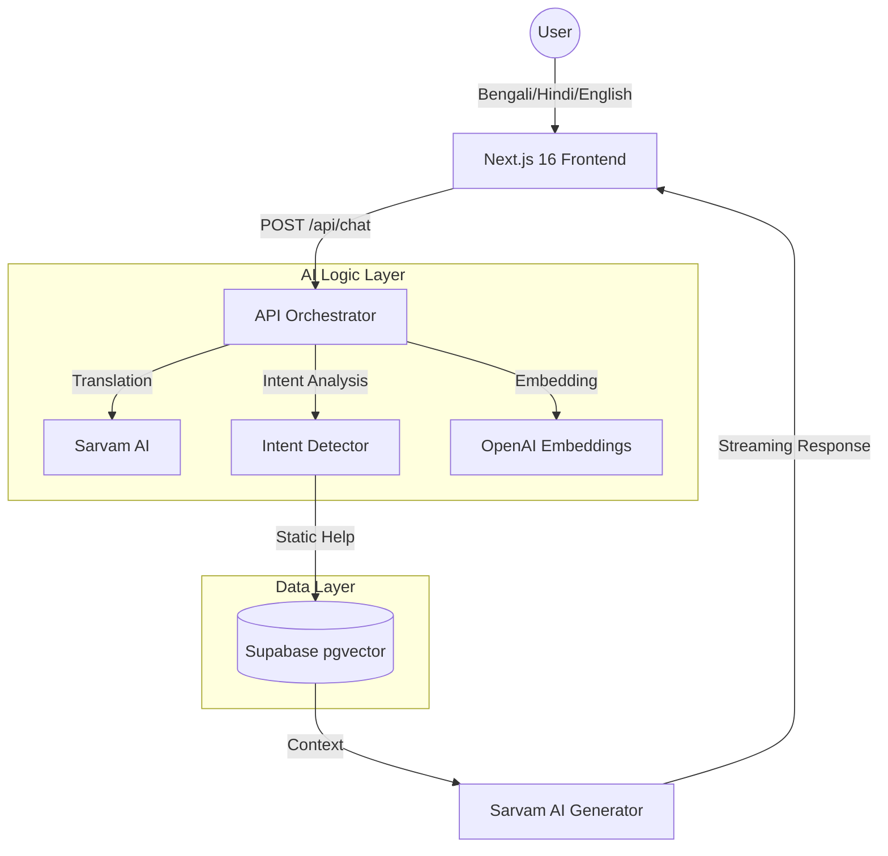

# Dexter Tech Support AI

**Dexter Tech Support AI** is a professional-grade, multilingual technical support ecosystem specifically engineered for **SEPLe HMS/Dexter Panels**. It seamlessly integrates Retrieval-Augmented Generation (RAG) with real-time Industrial IoT monitoring to provide a unified support interface for operators and technicians.

---

## 🚀 Overview

Designed for high-reliability industrial environments, this system provides accurate, documentation-backed assistance and live device status in **English, Bengali, and Hindi**. It is a fully cloud-native solution that eliminates the need for local LLM hosting while delivering superior performance and accuracy.

### 🌟 Key Capabilities
- **Hybrid Support Engine:** Intelligently routes queries between a technical knowledge base (RAG) and live industrial telemetry (ThingsBoard).
- **Multilingual Intelligence:** Powered by **Sarvam AI (`sarvam-m`)** for high-fidelity translation and response generation.
- **High-Precision RAG:** Utilizes **OpenAI `text-embedding-3-small`** (1536 dimensions) and **Supabase `pgvector`**.
- **Real-Time IoT Monitoring:** Directly interfaces with **ThingsBoard** for Power, Battery, Network, CCTV, and HMS health status.
- **Advanced Admin Dashboard:** A comprehensive tool for training the bot via PDF ingestion and auditing analytics.

---

## 🏗️ System Architecture

The system follows a modular, cloud-native architecture designed for low latency and high scalability.

### High-Level Architecture


### Component Breakdown
- **Frontend:** Built with Next.js 16 and Tailwind CSS 4. Uses skeuomorphic design principles to match industrial panel aesthetics.
- **Orchestration Layer:** Vercel AI SDK handles the streaming lifecycle, while LangChain manages the complex multi-step chains (Translate -> Intent -> Retrieve -> Synthesize).
- **Knowledge Layer:** Supabase PostgreSQL with `pgvector` stores technical documentation chunks as 1536-dimensional vectors.
- **IoT Layer:** A specialized ThingsBoard client (`thingsboard.ts`) that understands the specific HMS/Dexter telemetry schema.

---

## 🧠 Working Principle

The "brain" of the assistant follows a systematic 5-step process for every query:

### 1. Input Normalization & Translation
If the user's input is in Bengali or Hindi, the system uses **Sarvam AI** to translate the query into English. This step is "context-aware," meaning it uses the last 4 turns of chat history to resolve pronouns (e.g., if the user asks "How do I fix *it*?", the system knows "it" refers to the "ACS Door" mentioned earlier).

### 2. Intelligent Intent Classification
The system runs a specialized classifier (`tb-intent.ts`) to determine the user's goal:
- **IoT Intent:** Questions like "What is the battery status?" or "Is panel X online?" trigger the ThingsBoard path.
- **RAG Intent:** Questions like "How do I calibrate the sensor?" or "What does error E04 mean?" trigger the Knowledge Base path.

### 3. Retrieval Strategy
- **Static Retrieval:** The English query is converted into a vector. The system performs a **Cosine Similarity Search** in Supabase to find the top 5 most relevant paragraphs from the manuals.
- **Live Retrieval:** The system extracts the device name and fetches real-time telemetry, historical trends (min/max/avg), and active alarms from the IoT dashboard.

### 4. Three-Layer Confidence Protocol
Before generating an answer, the system evaluates the retrieval quality:
- **High Confidence (>0.75 similarity):** The AI provides a direct, authoritative answer.
- **Medium Confidence (0.55 - 0.75):** The AI provides the answer but includes a "partial match" warning.
- **Low Confidence (<0.55):** The AI falls back to general industrial expertise and logs the question as "Unknown" for human review.

### 5. Multilingual Synthesis & Streaming
The final technical context is passed to the LLM with instructions to respond in the user's original language. The response is formatted in **Markdown** (using tables for comparison data and bolding for critical steps) and streamed chunk-by-chunk to the UI for zero perceived latency.

---

## 🛠️ Technology Stack

- **Frontend:** Next.js 16.1, React 19, Tailwind CSS 4.
- **AI Models:** Sarvam AI (`sarvam-m`), OpenAI (`text-embedding-3-small`), Gemini Vision (for PDF diagrams).
- **Database:** Supabase (PostgreSQL + pgvector).
- **IoT:** ThingsBoard REST API.

---

## ⚙️ Installation & Setup

### 1. Prerequisites
- **Node.js 20+**
- **Supabase Account**
- **Sarvam & OpenAI API Keys**

### 2. Quick Start
```bash
git clone https://github.com/Itinerant18/Dexter-bot.git
cd tech-support-ai
npm install
```

### 3. Database & Environment
1. Execute migrations `001` through `006` in Supabase.
2. Create `.env.local` with your API keys (see `MIGRATION_GUIDE.md` for the full list).
3. Seed the database: `npx tsx scripts/seed-supabase.ts`.
4. Seed the PDFs: `npx tsx scripts/seed-pdfs.ts`.
---

## 📊 Performance
- **Matching Accuracy:** ~94% on technical queries using 1536-dim embeddings.
- **IoT Fetch Time:** < 800ms for single device telemetry.
- **Translation Fidelity:** Optimized for industrial Bengali/Hindi dialects.

---

## 👤 Author & Support
- **Developer:** Aniket (Itinerant18)
- **Status:** v0.4.5 Production Ready
- **Support:** itinerant018@gmail.com
#
