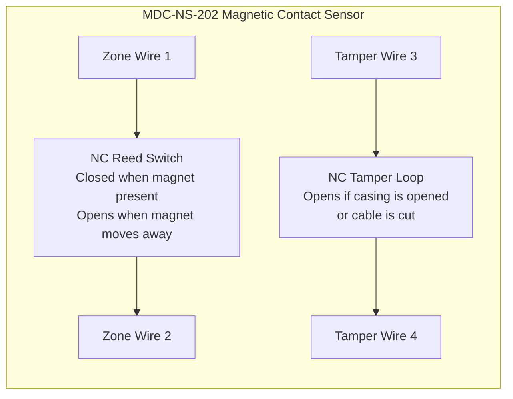

[ MDC-NS-202 Magnetic Switch wiring diagram ]

         +-----------------------------------------+
         |                                         |
Zone --- | --------[ NC Reed Switch ]------------- | --- Zone
Wire 1   |          (Opens when magnet             |     Wire 2
         |           is moved away)                |
         |                                         |
Tamper-- | --------[ NC Tamper Loop ]------------- | --- Tamper
Wire 3   |          (Opens if the casing           |     Wire 4
         |           or cable is compromised)      |
         +-----------------------------------------+

 # MDC-NS-202 Magnetic Switch Wiring Diagram

The MDC-NS-202 magnetic contact contains:

- **NC Reed Switch** for door/window monitoring  
- **NC Tamper Loop** for anti-tamper protection

Both loops connect to the **security control panel**.

---

## Internal Sensor Wiring

### Magnetic Switch Operation
| Condition   | Reed Switch | Panel Status    |
| ----------- | ----------- | --------------- |
| Door Closed | Closed      | Normal          |
| Door Opened | Open        | Alarm Triggered |

### Tamper Loop Operation
| Event            | Tamper Loop | Panel Response |
| ---------------- | ----------- | -------------- |
| Normal Condition | Closed      | System OK      |
| Sensor Opened    | Open        | Tamper Alarm   |
| Cable Cut        | Open        | Tamper Alarm   |

### Installation Example
flowchart LR

DOOR[Door Frame Magnet]

SENSOR[MDC-NS-202 Sensor]

PANEL[Security Control Panel]

DOOR --> SENSOR

SENSOR --> PANEL

### Signal Flow
Door Opens
     ↓
Magnet Moves Away
     ↓
Reed Switch Opens
     ↓
Zone Circuit Opens
     ↓
Security Panel Detects Alarm

### Wiring Summary
| Wire   | Function           |
| ------ | ------------------ |
| Wire 1 | Zone Input         |
| Wire 2 | Zone Return        |
| Wire 3 | Tamper Loop Input  |
| Wire 4 | Tamper Loop Return |
