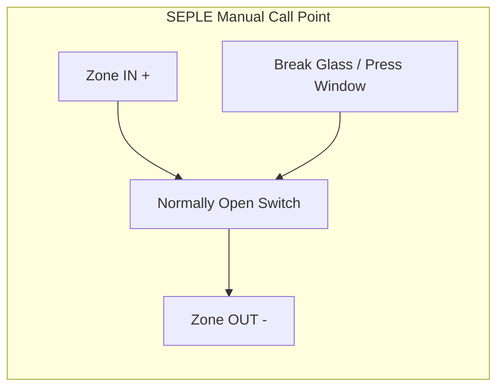

# SEPLE-MCP Manual Call Point (MCP)

The **SEPLE-MCP** is a **conventional fire alarm manual call point** installed in the fire alarm detection loop.

It operates on:

• Conventional fire alarm zone loop  
• Operating voltage up to **26V DC**  
• **Normally Open (NO) activation switch**

When the glass is **broken or pressed**, the switch closes and **shorts the zone**, triggering the fire alarm panel.

---

# 1. Internal MCP Mechanism


### Operation
| State                | Switch Condition | Zone Status     |
| -------------------- | ---------------- | --------------- |
| Normal               | Open             | No alarm        |
| Glass pressed/broken | Closed           | Alarm triggered |

# 2. Conventional Fire Alarm Loop Wiring
flowchart LR

PANEL[Fire Alarm Control Panel]

MCP1[Manual Call Point]

MCP2[Smoke Detector]

EOL[End Of Line Resistor]

PANEL --> MCP1

MCP1 --> MCP2

MCP2 --> EOL

EOL --> PANEL

# 3. MCP Activation Process
flowchart TD

USER[User Breaks Glass]

USER --> SWITCH[NO Switch Closes]

SWITCH --> SHORT[Zone Loop Shorted]

SHORT --> PANEL[Fire Alarm Panel Detects Fault]

PANEL --> ALARM[Alarm Triggered]

ALARM --> SIREN[Siren Activated]

ALARM --> LED[Alarm LED ON]

# 4. Internal Contact Wiring
        SEPLE-MCP

  Zone IN (+) ───────┐
                     │
                     │
               ┌─────┴─────┐
               │ Normally  │
               │ Open      │
               │ Switch    │
               └─────┬─────┘
                     │
                     │
  Zone OUT (-) ──────┘

# 5. Example Panel Connection
flowchart LR

PANEL[Fire Alarm Control Panel]

MCP[Manual Call Point]

SIREN[Alarm Siren]

PANEL --> MCP

MCP --> PANEL

PANEL --> SIREN

# 6. Electrical Characteristics
| Parameter         | Value               |
| ----------------- | ------------------- |
| Operating Voltage | up to 26V DC        |
| Contact Type      | Normally Open       |
| Activation        | Glass break or push |
| Reset Type        | Manual reset key    |
| Zone Type         | Conventional loop   |


# 7. System Alarm Flow
User presses MCP
        ↓
Glass breaks / switch pressed
        ↓
NO switch closes
        ↓
Zone loop changes state
        ↓
Fire alarm panel detects alarm
        ↓
Siren + alarm indicators activate


# 8. Typical Installation Height
| Location      | Height           |
| ------------- | ---------------- |
| Wall mounting | 1.4 m from floor |
| Corridor      | Near exit route  |
| Staircase     | Landing area     |


# 9. Reset Procedure
```
1. Unlock MCP with reset key
2. Open cover
3. Replace glass if broken
4. Close cover
5. Turn key to lock position
6. Panel automatically resets
```


# 10. Troubleshooting
| Issue | Cause | Solution |
|-------|-------|----------|
| No alarm when pressed | Glass not fully broken | Break glass completely |
| Panel shows fault | EOL resistor missing | Install EOL resistor |
| Alarm won't reset | Key not turned fully | Turn key to lock position |


# 11. Safety Precautions
- Always test after installation
- Use correct replacement glass
- Do not tamper with mechanism
- Keep reset key secure

---
> 📚 **Source:** SEPLE-MCP technical documentation and conventional fire alarm system standards.
