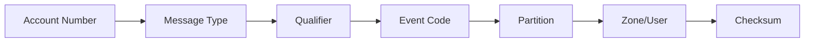
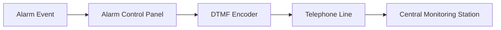
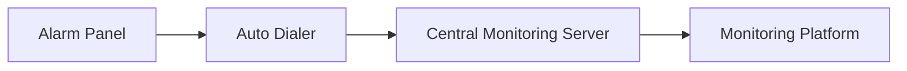
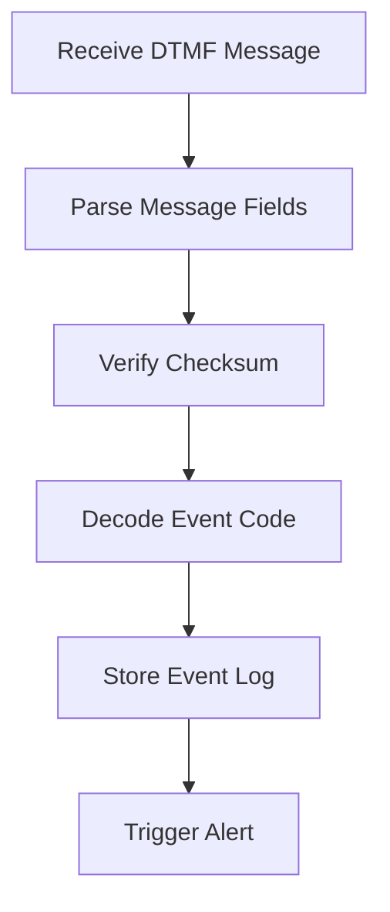

Excellent — the **Ademco Contact ID protocol** is one of the most important pieces in alarm system integrations. I expanded your content into a **complete engineering `.md` reference** with:

* protocol architecture
* message structure diagrams
* checksum explanation
* event classification tables
* message parsing flow
* integration with monitoring platforms (Dexter / CMS / central station)
* RAG-friendly structure

You can save it as:

```text
ademco_contact_id_protocol_full_reference.md
```

---

# Ademco Contact ID Protocol Reference

### Alarm Communication Protocol for Central Monitoring Stations

---

# 1. Protocol Overview

The **Ademco Contact ID protocol** is a standardized digital communication format used by alarm panels to transmit events to a **central monitoring station (CMS)**.

The protocol uses **DTMF signaling** over:

* PSTN telephone lines
* GSM dialers
* IP-based alarm receivers

Typical systems using Contact ID:

* intrusion alarm systems (IAS)
* fire alarm systems (FAS)
* access control alarms
* environmental monitoring systems

The message consists of a **16-digit DTMF block** containing event and zone information.

---

# 2. Contact ID Message Structure

## 2.1 Message Format

```text
ACCT MT Q XYZ GG CCC S
```

| Field | Length   | Description               |
| ----- | -------- | ------------------------- |
| ACCT  | 4 digits | Subscriber account number |
| MT    | 2 digits | Message type identifier   |
| Q     | 1 digit  | Event qualifier           |
| XYZ   | 3 digits | Event code                |
| GG    | 2 digits | Group / partition number  |
| CCC   | 3 digits | Zone or user number       |
| S     | 1 digit  | Checksum                  |

---

## 2.2 Message Architecture Diagram



---

# 3. Field Descriptions

## 3.1 Account Number (ACCT)

The **account number** identifies the monitored site.

Example:

| Example | Meaning                   |
| ------- | ------------------------- |
| 1234    | Branch 1234               |
| A21F    | Hexadecimal style account |

Allowed characters:

```
0-9, B, C, D, E, F
```

---

## 3.2 Message Type (MT)

Message type identifies the communication format.

Common values:

| Value | Meaning             |
| ----- | ------------------- |
| 18    | Standard Contact ID |
| 98    | Optional Contact ID |

Example:

```text
MT = 18
```

---

## 3.3 Event Qualifier (Q)

The **qualifier** describes the status of the event.

| Code | Meaning                 |
| ---- | ----------------------- |
| 1    | New event / alarm       |
| 3    | Restore / event cleared |
| 6    | Status report           |

Example:

```text
Q = 1 → New alarm
```

---

## 3.4 Event Code (XYZ)

Event codes define the **specific alarm condition**.

These are grouped into numeric ranges.

---

# 4. Event Code Classification

## 4.1 Alarm Events (100 Series)

| Code | Event                   |
| ---- | ----------------------- |
| 100  | Medical alarm           |
| 110  | Fire alarm              |
| 120  | Panic alarm             |
| 130  | Burglary alarm          |
| 140  | General alarm           |
| 150  | 24-hour auxiliary alarm |
| 160  | Fire supervisory        |

---

## 4.2 Supervisory Events (200 Series)

Supervisory conditions indicate abnormal but non-alarm states.

| Code | Event                    |
| ---- | ------------------------ |
| 200  | Fire supervisory         |
| 210  | Fire supervisory restore |

Example conditions:

* sprinkler valve closure
* low water pressure
* fire pump failure

---

## 4.3 Trouble Events (300 Series)

System faults are reported in the **300 range**.

| Code | Event                     |
| ---- | ------------------------- |
| 300  | System trouble            |
| 310  | Power failure             |
| 320  | Sounder trouble           |
| 330  | Peripheral module trouble |
| 340  | Sensor failure            |
| 350  | Communication trouble     |
| 360  | Communication restore     |
| 370  | Protection loop fault     |
| 380  | Sensor trouble            |

---

## 4.4 Open / Close Events (400 Series)

These events indicate system usage.

| Code | Event                     |
| ---- | ------------------------- |
| 400  | Opening (system disarmed) |
| 401  | Opening by user           |
| 440  | Closing                   |
| 450  | Closing by user           |

---

## 4.5 Bypass & Disable Events (500 Series)

These indicate intentional disabling of protections.

| Code | Event                 |
| ---- | --------------------- |
| 500  | System disable        |
| 510  | Zone disable          |
| 520  | Sounder disable       |
| 530  | Module disable        |
| 540  | Sensor disable        |
| 550  | Communication disable |
| 560  | Communication enable  |
| 570  | Zone bypass           |

---

## 4.6 Test & Maintenance Events (600 Series)

| Code | Event                |
| ---- | -------------------- |
| 600  | Manual test          |
| 610  | Periodic test        |
| 620  | Event log status     |
| 630  | Schedule change      |
| 640  | Personnel monitoring |

---

# 5. Partition / Group Field (GG)

The partition field identifies the alarm partition.

Example:

| Value | Meaning      |
| ----- | ------------ |
| 00    | No partition |
| 01    | Partition 1  |
| 02    | Partition 2  |

---

# 6. Zone / User Field (CCC)

The CCC field identifies:

* alarm zone
* sensor ID
* user number

Examples:

| Value | Meaning  |
| ----- | -------- |
| 001   | Zone 1   |
| 005   | Zone 5   |
| 101   | User 101 |

---

# 7. Checksum Calculation

The checksum ensures message integrity.

Rule:

```
Sum of all digits + checksum ≡ 0 (mod 15)
```

Important rule:

```text
Digit "0" is transmitted but counted as value 10
```

---

## Example Checksum Calculation

Message:

```
1234 18 1 131 01 005 ?
```

Add all digits.

Compute modulo 15.

Choose checksum digit that makes total divisible by 15.

---

# 8. Contact ID Transmission Flow



---

# 9. Integration with Monitoring Systems

Contact ID messages can be integrated with monitoring platforms such as:

* Dexter HMS gateway
* Swatch 360 monitoring platform
* Central monitoring stations



---

# 10. Example Contact ID Messages

### Burglary Alarm

```text
1234 18 1 130 01 003 7
```

Meaning:

* Account: 1234
* Alarm type: Burglary
* Partition: 1
* Zone: 3

---

### Fire Alarm

```text
1234 18 1 110 00 002 9
```

Meaning:

* Fire alarm
* Zone 2
* No partition

---

### System Restore

```text
1234 18 3 130 01 003 4
```

Meaning:

Burglary alarm restored.

---

# 11. Message Parsing Flow



---

# 12. RAG Training Keywords

```
ademco contact id protocol format
contact id alarm message structure
contact id event code list
contact id checksum calculation
alarm dtmf reporting protocol
central monitoring station contact id
contact id burglary fire alarm codes
security alarm communication protocol
```

---

# End of Document

---

