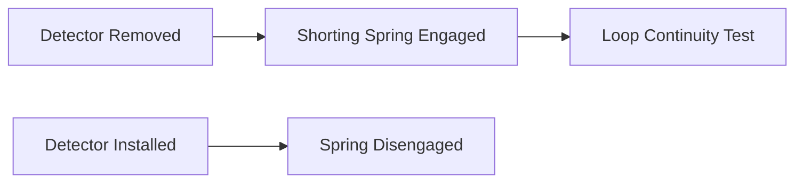
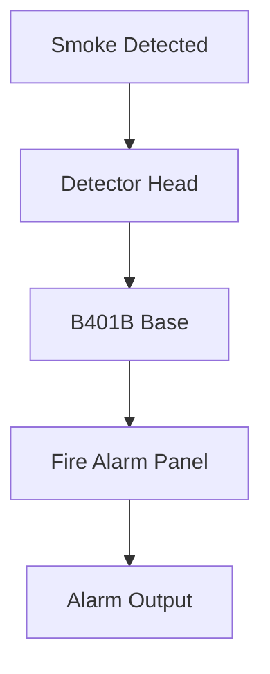

# B401B Plug-in Detector Base Wiring Reference

### System Sensor Conventional Fire Detector Base

---

# 1. System Overview

The **B401B detector base** is a plug-in mounting base used with System Sensor conventional smoke and heat detector heads including:

| Detector Model | Type                                |
| -------------- | ----------------------------------- |
| 1451           | Photoelectric Smoke Detector        |
| 2451           | Photoelectric Smoke Detector        |
| 2451TH         | Photoelectric Smoke + Heat Detector |

The base is designed for **2-wire fire detection loops**, where:

* the same pair of wires carries **power**
* the same pair carries **alarm signaling**

Typical use cases:

* conventional fire alarm systems
* small fire panels
* zone-based fire detection loops

---

# 2. Detector Loop Architecture

A fire alarm panel supervises detector loops by monitoring resistance and current flow.


---

# 3. B401B Terminal Layout

The B401B base contains **four main terminals**.

| Terminal   | Function                  |
| ---------- | ------------------------- |
| Terminal 1 | Remote annunciator output |
| Terminal 2 | Positive line (in/out)    |
| Terminal 3 | Negative line (in)        |
| Terminal 4 | Negative line (out)       |

---

# 4. B401B Wiring Diagram

```text id="1w3xye"
FIRE ALARM CONTROL PANEL

     (+) Line        (-) Line
        |                |
        v                v

+--------------------------------------+
| B401B DETECTOR BASE 1                |
|                                      |
| Terminal 2  <---- Positive In/Out    |
| Terminal 3  <---- Negative In        |
| Terminal 4  ----> Negative Out       |
|                                      |
| Terminal 1 ----> Remote Annunciator  |
|                                      |
| Internal Shorting Spring             |
| (Shorts terminals 3 & 4 when         |
|  detector head is removed)           |
+--------------------------------------+

        |
        v

+--------------------------------------+
| B401B DETECTOR BASE 2                |
|                                      |
| Terminal 2  <---- Positive In/Out    |
| Terminal 3  <---- Negative In        |
| Terminal 4  ----> Negative Out       |
|                                      |
| Terminal 1 ----> Remote Annunciator  |
+--------------------------------------+

        |
        v

+-------------------------------+
| END OF LINE DEVICE (EOL)      |
+-------------------------------+
```

---

# 5. Remote Annunciator Circuit

Terminal **1** provides a connection for a **remote LED indicator**.

Purpose:

* indicates detector alarm state remotely
* commonly installed outside rooms or corridors

Example use:

```text id="ntw3jv"
Detector inside server room
Remote LED outside door
```

When the detector triggers, the external LED illuminates.

---

# 6. Shorting Spring Mechanism

The B401B base includes a **spring-type shorting contact**.

### Purpose

Allows testing of loop wiring **before installing detectors**.

### Operation

| Detector State     | Electrical Behavior           |
| ------------------ | ----------------------------- |
| Detector removed   | Terminals 3 and 4 are shorted |
| Detector installed | Spring disengages             |

---

## Shorting Spring Diagram



---

# 7. Loop Supervision Rules

Fire alarm panels supervise loops to detect:

* open circuits
* short circuits
* detector removal

### Important wiring rule

```text id="0uvm4h"
Do NOT loop wires under terminals 2, 3, and 4.
```

Instead:

* break the conductor
* terminate both wires individually

This allows the panel to detect wiring faults.

---

# 8. End-of-Line Device (EOL)

The **End-of-Line resistor or module** is installed at the last device.

Purpose:

* allows the fire panel to supervise the loop
* detects wiring faults

Typical EOL values:

| Panel Type              | EOL Value |
| ----------------------- | --------- |
| Conventional fire panel | 4.7kΩ     |
| Some systems            | 6.8kΩ     |

---

# 9. Alarm Detection Flow



---

# 10. Tamper Resistance

The base includes a **breakable plastic tab**.

Purpose:

* prevents unauthorized detector removal

### Activation

1. Break off tamper tab.
2. Detector can no longer rotate freely.
3. Requires screwdriver to remove.

---

# 11. Installation Best Practices

| Rule                                       | Reason                   |
| ------------------------------------------ | ------------------------ |
| Use supervised loop wiring                 | Detect faults            |
| Do not loop wires under terminals          | Maintain supervision     |
| Install EOL resistor at last device        | Enable loop monitoring   |
| Use remote LED where visibility is limited | Improve alarm indication |

---

# 12. Troubleshooting Guide

| Problem                  | Possible Cause                 |
| ------------------------ | ------------------------------ |
| Panel shows open circuit | Broken loop wire               |
| Detector not responding  | Head not seated properly       |
| Continuous alarm         | Shorted loop                   |
| Remote LED not lighting  | Wiring to terminal 1 incorrect |

---

# 13. Integration with Fire Alarm Systems

The B401B base integrates with conventional fire alarm panels.


---

# 14. RAG Training Keywords

```text id="b9tews"
b401b detector base wiring
system sensor detector base terminals
b401b remote annunciator wiring
fire alarm detector loop supervision
b401b shorting spring operation
system sensor 1451 detector base
conventional fire alarm detector loop
fire alarm eol resistor supervision
```

---

# End of Document
