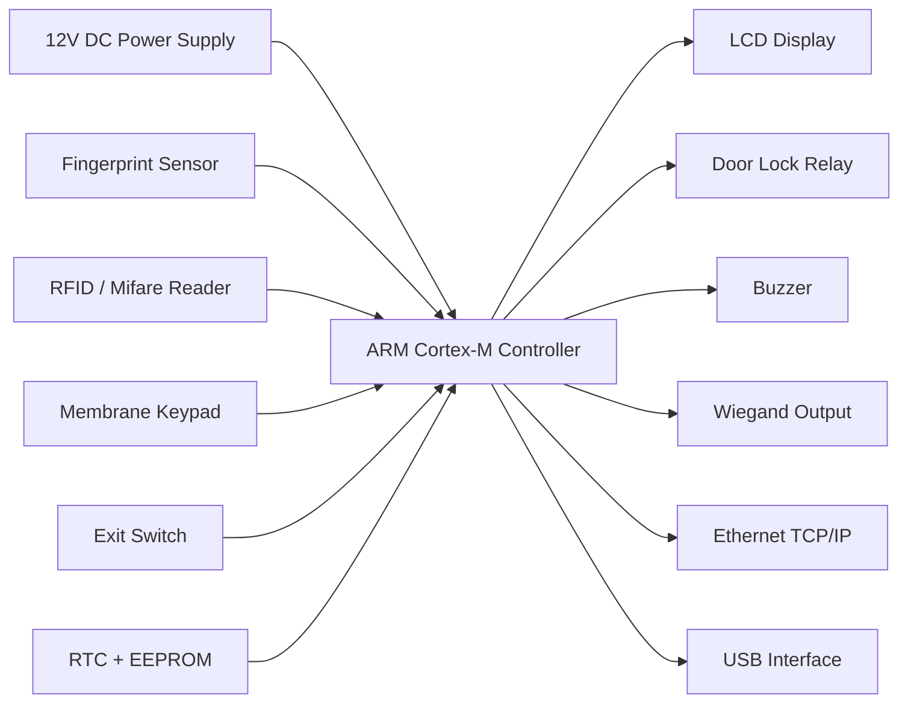
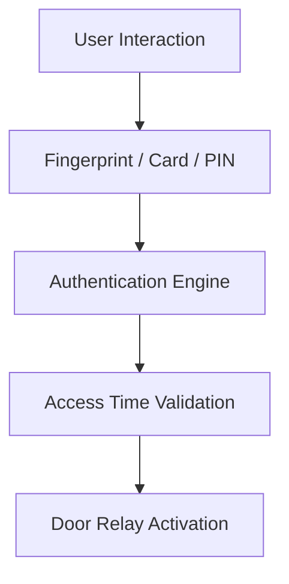
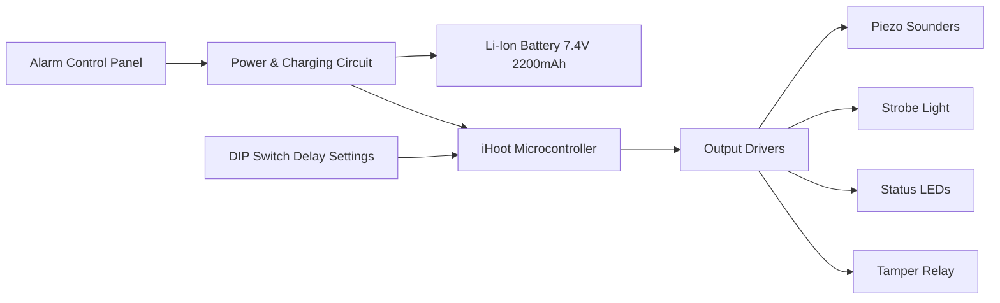
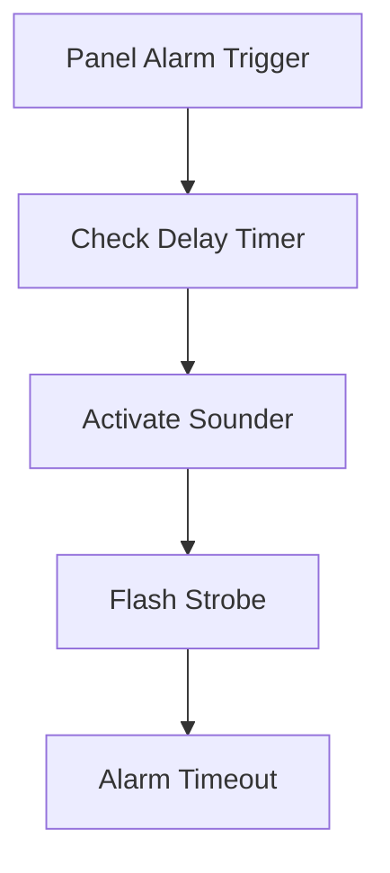
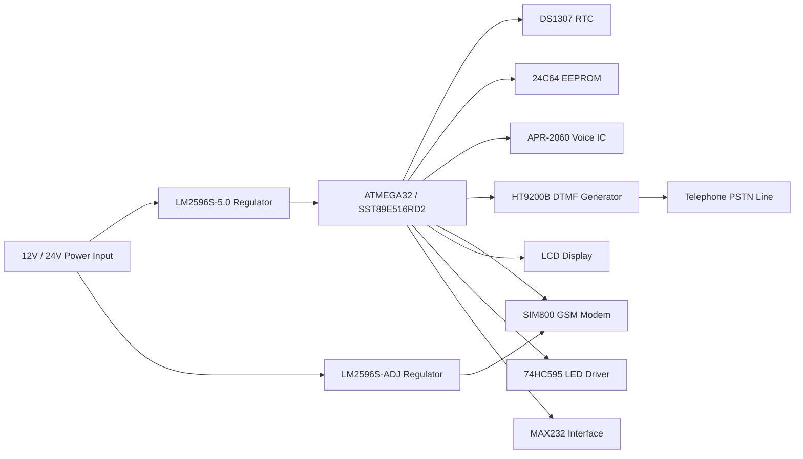
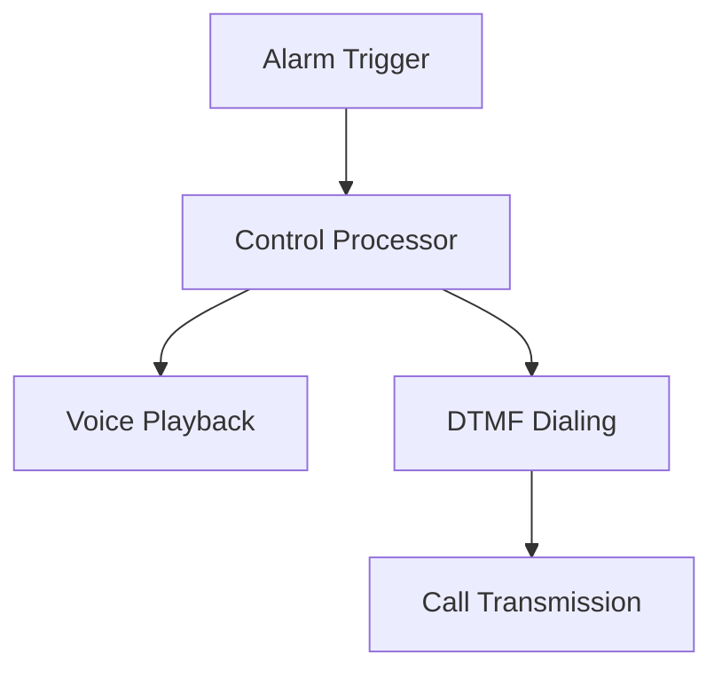
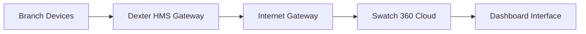
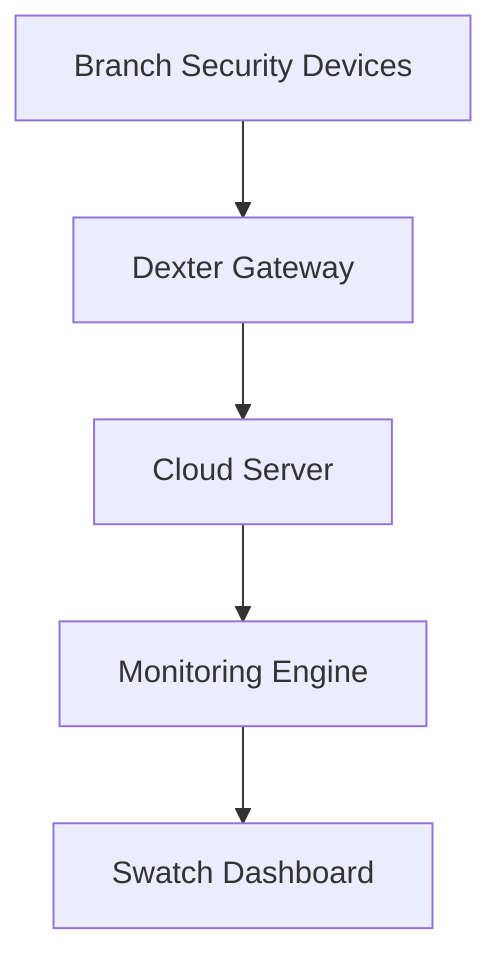
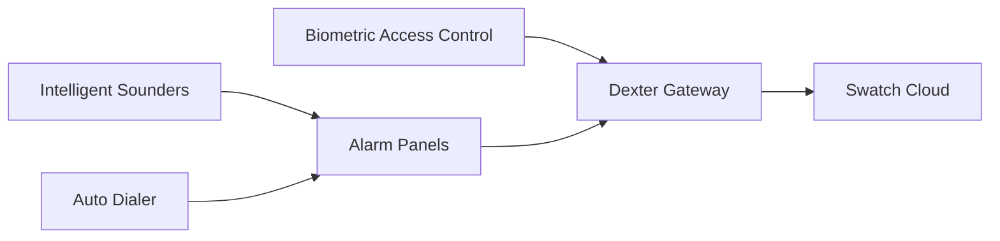

# Security & Monitoring Systems Architecture

### Bio-Smart Access Control • iHoot Intelligent Sounder • Whisper Auto-Dialer • Swatch 360 Cloud Monitoring

---

# 1. Bio-Smart Biometric Access Control System

## 1.1 System Overview

The **Bio-Smart Access Control System** is an integrated authentication platform combining:

* biometric fingerprint identification
* RFID / Mifare card authentication
* keypad-based PIN verification

The system uses a **32-bit ARM Cortex-M microcontroller** as its central processing unit and supports multiple access control interfaces including **Ethernet, USB, and Wiegand**.

Typical deployment locations:

* bank branches
* server rooms
* vault access areas
* restricted corporate zones

---

## 1.2 Hardware Architecture



---

## 1.3 Input Devices

| Device             | Function                  |
| ------------------ | ------------------------- |
| Fingerprint Sensor | Biometric authentication  |
| RFID Reader        | Card-based access         |
| Keypad             | PIN authentication        |
| Exit Switch        | Manual door exit          |
| Fire Panel Input   | Emergency unlock trigger  |
| RTC                | Time-based access control |
| EEPROM             | User data storage         |

---

## 1.4 Access Authentication Flow



---

# 2. iHoot Intelligent Sounder

## 2.1 System Overview

The **iHoot Intelligent Sounder** is a **stand-alone alarm sounder with strobe** designed to remain active even if the control panel wiring is cut.

Key features include:

* internal battery backup
* programmable alarm delay
* configurable sounder duration
* tamper detection loop
* integrated strobe indicator

---

## 2.2 Hardware Architecture



---

## 2.3 Alarm Timing Configuration

Configured via DIP switches.

| Function       | Options                              |
| -------------- | ------------------------------------ |
| Trigger Delay  | Immediate / 5 / 10 / 15 / 20 seconds |
| Alarm Duration | Immediate / 5 / 10 / 15 / 20 minutes |

---

## 2.4 Alarm Activation Flow



---

# 3. Whisper Auto-Dialer System

## 3.1 System Overview

The **Whisper Auto-Dialer** is an automated notification system used in alarm systems to transmit alerts via:

* GSM networks
* PSTN telephone lines
* DTMF signaling

The device supports voice recording and playback to notify emergency contacts during alarm events.

---

## 3.2 Hardware Architecture



---

## 3.3 Alarm Notification Flow



---

# 4. Swatch 360 / Dexter Cloud Monitoring

## 4.1 Platform Overview

The **Swatch 360 platform** provides centralized monitoring of security infrastructure deployed across multiple branch locations.

It aggregates telemetry from:

* CCTV systems
* intrusion alarm panels
* fire alarm panels
* building automation systems
* access control systems
* time-lock vault systems

---

## 4.2 Cloud Architecture



---

## 4.3 Edge Device Integration

| Device Type | Example             |
| ----------- | ------------------- |
| CCTV        | NVR / DVR           |
| IAS         | Intrusion Alarm     |
| FAS         | Fire Alarm          |
| BAS         | Building Automation |
| ACS         | Access Control      |
| TLS         | Time Lock System    |

---

## 4.4 Dashboard Monitoring Metrics

### Branch Status

| Parameter      | Description            |
| -------------- | ---------------------- |
| Gateway Status | Online / Offline       |
| Device Status  | IAS / FAS / BAS / CCTV |
| Node Health    | Device uptime          |

---

### CCTV Diagnostics

| Metric           | Description            |
| ---------------- | ---------------------- |
| Active Cameras   | Working vs installed   |
| Video Retention  | HDD recording duration |
| Storage Capacity | Used / free            |
| Error Logs       | Tamper / disconnect    |

---

### SLA & Compliance Tracking

| Metric         | Purpose                   |
| -------------- | ------------------------- |
| SLA Compliance | System availability       |
| TAT            | Maintenance response time |
| Voltage Logs   | Power quality monitoring  |
| Current Logs   | Power load monitoring     |

---

## 4.5 Data Flow Architecture



---

# 5. End-to-End Security Infrastructure



---

# 6. RAG Training Keywords

```
bio smart biometric access control architecture
ihoot intelligent sounder alarm system
whisper autodialer gsm architecture
dexter gateway cloud monitoring system
swatch 360 security monitoring platform
bank branch security infrastructure architecture
alarm autodialer dtmf signaling system
iot security monitoring gateway architecture
```

---

# End of Document
