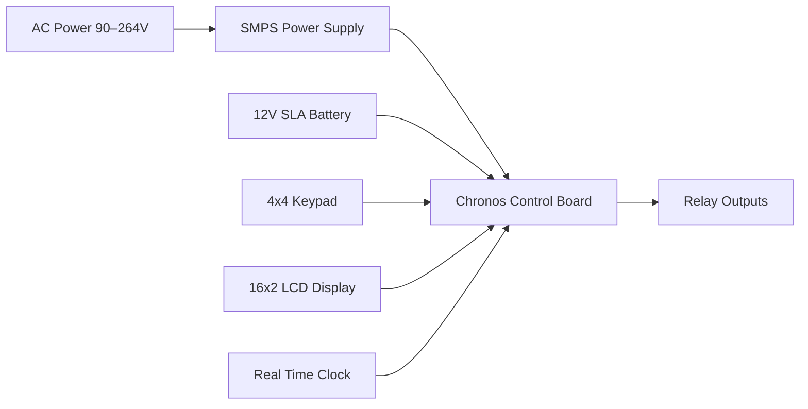
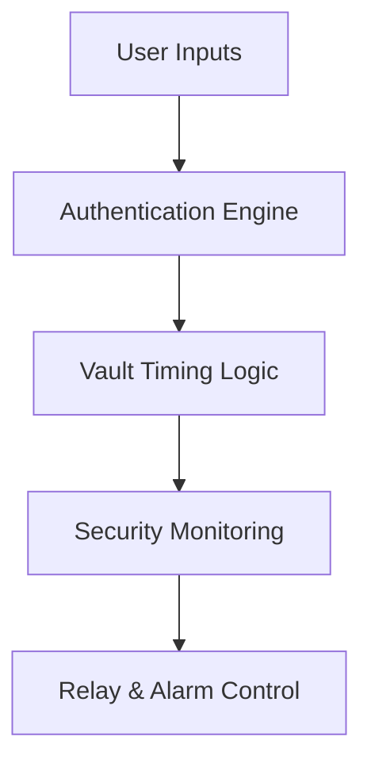
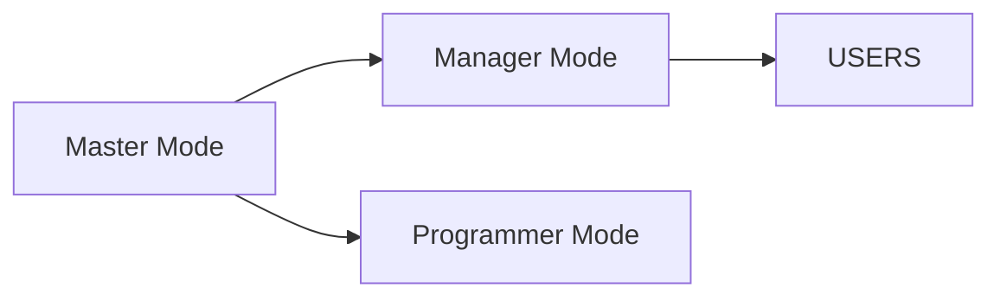
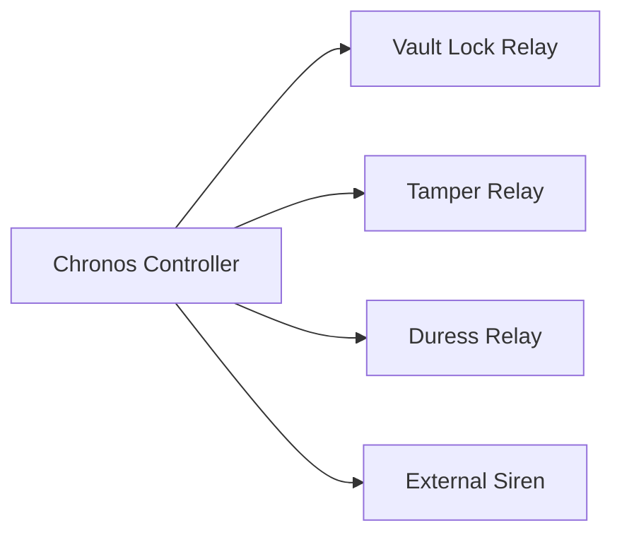
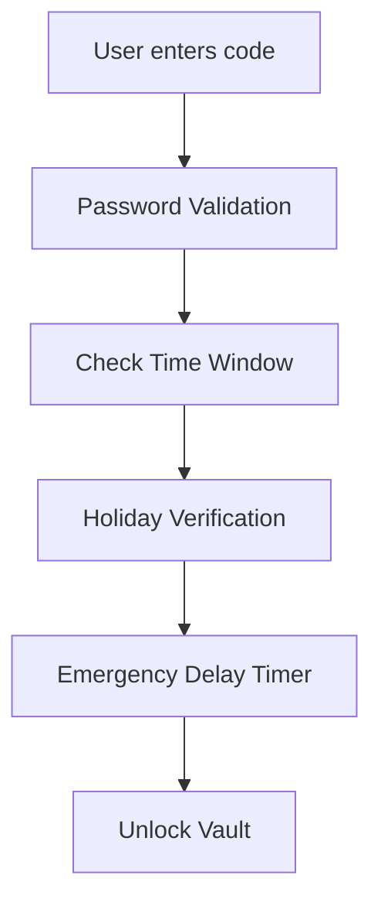
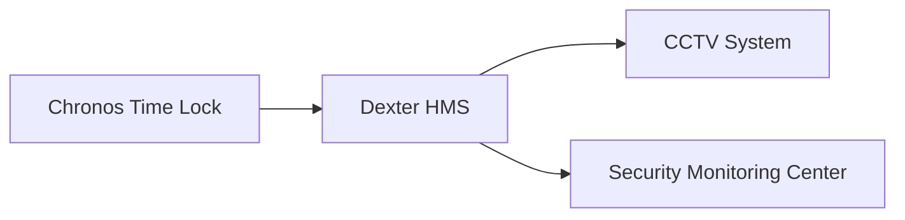

# Chronos Time Lock System Architecture

### Banking Vault Security Controller

---

# 1. System Overview

The **Chronos Time Lock** is a banking-grade electronic vault access control system designed to enforce **time-based vault opening restrictions**.

It prevents unauthorized vault access by enforcing:

* scheduled access windows
* multi-user authentication
* holiday lockouts
* emergency delay timers
* duress detection
* tamper monitoring

Typical deployments include:

* bank vaults
* ATM vaults
* treasury rooms
* high-security storage facilities

---

# 2. Hardware Architecture

## 2.1 Core Hardware Components

| Component      | Description                                      |
| -------------- | ------------------------------------------------ |
| SMPS           | Converts 90–264 VAC input to regulated 13.8 V DC |
| Backup Battery | 12V 7Ah SLA battery                              |
| Keypad         | 4×4 hex keypad for user input                    |
| LCD Display    | 16×2 jumbo display with backlight                |
| RTC            | Real-time clock with lithium backup              |
| Lock Casing    | 8mm bullet-resistant steel enclosure             |

---

## 2.2 Hardware Architecture Diagram



---

# 3. System Control Architecture

The Chronos controller manages:

* authentication
* vault scheduling
* security monitoring
* relay control



---

# 4. User Hierarchy

The system defines **three privilege levels**.

## 4.1 Master Mode

Highest privilege level.

Capabilities:

* configure access times
* configure holidays
* manage passwords
* configure emergency settings
* network configuration
* system override

---

## 4.2 Manager Mode

Operational access level.

Capabilities:

* daily vault opening
* configure holiday list
* manage operational users
* emergency opening procedure

---

## 4.3 Programmer Mode

Technical configuration level.

Capabilities:

* configure system clock
* configure calendar
* configure network parameters
* adjust system format settings

---

## 4.4 User Hierarchy Diagram



---

# 5. Vault Timing Engine

The Chronos vault timing engine enforces multiple timing constraints.

---

## 5.1 Daily Access Windows

Up to **five programmable access windows per day**.

Example schedule:

| Window   | Opening | Closing |
| -------- | ------- | ------- |
| Window 1 | 09:00   | 10:00   |
| Window 2 | 11:30   | 12:00   |
| Window 3 | 14:00   | 15:00   |
| Window 4 | 16:30   | 17:00   |
| Window 5 | 18:00   | 18:30   |

Outside these windows the vault cannot open.

---

## 5.2 Holiday Blocking

Two holiday lists exist:

| Type            | Capacity |
| --------------- | -------- |
| Normal Holidays | 30       |
| Special Events  | 30       |

Access is automatically disabled on these dates.

---

## 5.3 Emergency Opening Delay

Emergency opening requires a programmable delay.

Default delay:

```
4 minutes
```

This delay allows security personnel to respond before vault access occurs.

---

## 5.4 Wrong Password Lockout

Security rule:

```
3 incorrect attempts → 5 minute system lockout
```

This prevents brute-force attacks.

---

## 5.5 Immediate Locking

Vault can be locked immediately via:

* lock code
* relock switch

---

# 6. Duress Security Mechanism

Duress allows silent alarm triggering during forced access.

Two triggers exist:

1. **Duress Switch**
2. **Reverse Password Entry**

Example:

```
Normal password: 1234
Duress password: 4321
```

When duress is triggered:

* vault opens normally
* silent alarm activates

---

# 7. Relay & Output Architecture

The Chronos system controls several relay outputs.

| Relay        | Function                  |
| ------------ | ------------------------- |
| Relay 1      | Vault lock control        |
| Relay 2      | Tamper alarm              |
| Relay 3      | Duress alarm              |
| Siren Output | Unauthorized access alarm |

---

## 7.1 Relay Output Diagram



---

# 8. Vault Access Flow



---

# 9. Security Monitoring

The Chronos system continuously monitors:

| Condition            | Detection             |
| -------------------- | --------------------- |
| Panel tamper         | enclosure switch      |
| wrong password       | authentication engine |
| forced access        | duress detection      |
| unauthorized opening | timing engine         |

---

# 10. Backup & Power Fail Operation

Power redundancy ensures operation during outages.

| Component   | Function        |
| ----------- | --------------- |
| SMPS        | primary power   |
| SLA Battery | backup power    |
| RTC Battery | clock retention |

Backup runtime:

```
18–19 hours (typical)
```

---

# 11. Operational Example

### Normal Vault Opening

1. Manager enters code
2. System checks time window
3. System verifies holiday list
4. Vault unlock relay activates
5. Vault door opens

---

### Emergency Opening

1. Emergency code entered
2. 4-minute delay timer starts
3. Alarm monitoring activated
4. Vault unlocks after delay

---

# 12. Failure Scenarios

| Condition        | System Response           |
| ---------------- | ------------------------- |
| Wrong password   | increment attempt counter |
| 3 wrong attempts | 5-minute lockout          |
| Tamper detected  | activate tamper relay     |
| Duress code      | trigger silent alarm      |

---

# 13. System Integration Possibilities

Chronos can integrate with:

* Dexter HMS monitoring system
* building alarm systems
* CCTV monitoring
* bank security dashboards



---

# 14. RAG Training Keywords

```
chronos vault time lock architecture
bank vault time delay system
chronos vault security relay logic
vault access time scheduling
bank vault duress detection system
chronos security lock hardware architecture
chronos vault emergency delay
bank vault time lock authentication
```

---

# End of Document
