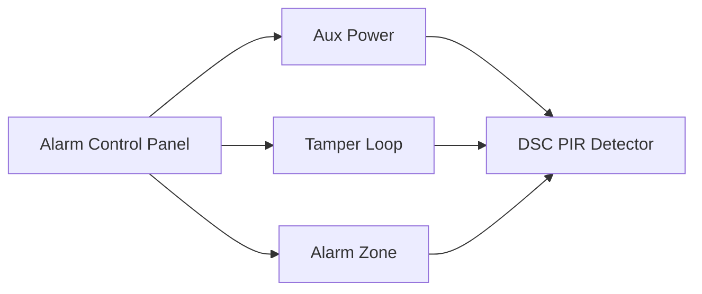
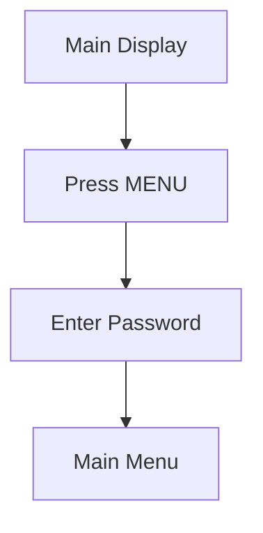
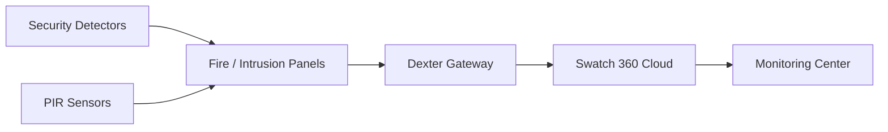

# Security Detection & Monitoring Systems Architecture

### Apollo Detector Bases • DSC PIR Sensors • Hestia Fire Panel • Swatch 360 Monitoring

---

# 1. Apollo Series 65 Specialty Detector Bases

## 1.1 System Overview

Apollo Series 65 specialty bases extend the functionality of standard smoke detector bases by integrating:

* relay outputs
* sounder drivers
* isolated earth connections
* auxiliary triggering

Two commonly deployed bases include:

| Model     | Type         | Purpose                             |
| --------- | ------------ | ----------------------------------- |
| 45681-508 | Relay Base   | Security system relay output        |
| 45681-512 | Sounder Base | Detector + integrated alarm sounder |

These bases are used in:

* fire alarm systems
* intrusion alarm systems
* building automation integrations

---

# 1.2 Relay Base Architecture (45681-508)

The relay base includes a **volt-free changeover relay** used to trigger external systems.

Typical applications:

* door release
* alarm signal relay
* building automation trigger
* fire suppression integration

---

## Relay Base Wiring Diagram

```text
SECURITY PANEL
  DC+     DC-
   |       |
   |       +------------------------+
   |                                |
   v                                v
+------------------------------------------------+
| APOLLO 12V RELAY BASE (45681-508)              |
|                                                |
| Terminal Block                                 |
| IN+  <---- DC + Input                          |
| OUT+ ----> DC + Output                         |
|                                                |
| Moulding Terminals                             |
| L1 IN  <---- DC - Input                        |
| L1 OUT ----> DC - Output                       |
|                                                |
| Relay Contacts                                 |
| NO  ---- Normally Open                         |
| C   ---- Common                                |
| NC  ---- Normally Closed                       |
|                                                |
| Output to                                     |
| Door Drop / Alarm Trigger / Control System     |
+------------------------------------------------+
```

⚠ **Important installation note**

```text
Do NOT connect to the -R terminal.
```

---

# 1.3 Sounder Base Architecture (45681-512)

The **Apollo Sounder Base** integrates a **32-tone alarm sounder** beneath the detector head.

Key feature:

Separate circuits for:

* detector loop
* sounder loop

This design prevents interference with fire detection signaling.

---

## Sounder Base Wiring

```text
FIRE ALARM CONTROL PANEL

 Detector Loop               Sounder Loop
 L+      L-                  DC+      DC-
 |       |                   |        |
 v       v                   v        v

+------------------------------------------------+
| APOLLO SERIES 65 SOUNDER BASE (45681-512)      |
|                                                |
| Detector Terminals                             |
| L1 IN  <---- Loop Positive In                  |
| L1 OUT ----> Loop Positive Out                 |
| L2     <---- Loop Negative                     |
|                                                |
| Sounder PCB Terminals                          |
| SNDR + IN   <---- Sounder Positive In          |
| SNDR + OUT  ----> Sounder Positive Out         |
| SNDR - IN   <---- Sounder Negative In          |
| SNDR - OUT  ----> Sounder Negative Out         |
|                                                |
| Earth Terminals                                |
| EARTH 1  -> Detector Shield                    |
| EARTH 2  -> Sounder Circuit                    |
+------------------------------------------------+
```

⚠ **Critical rule**

```text
EARTH 1 and EARTH 2 must remain isolated.
```

---

# 2. DSC LC-Series PIR & Microwave Sensors

## 2.1 System Overview

DSC LC-Series detectors use **quad linear imaging PIR technology** with optional microwave verification.

Models include:

| Model        | Technology                  |
| ------------ | --------------------------- |
| LC-103-PIMSK | PIR motion sensor           |
| LC-104-PIMW  | PIR + microwave dual sensor |

These detectors are used in:

* intrusion detection systems
* perimeter protection
* vault room monitoring

---

# 2.2 PIR Sensor Wiring Architecture



---

# 2.3 Terminal Block Wiring

```text
+-------------------------------------------------------+
| DSC LC-SERIES PIR TERMINAL BLOCK                     |
+-------------------------------------------------------+

T2  ----> Tamper Switch (NC)
T1  ----> Tamper Loop Return

NC  ----> Alarm Relay (Normally Closed)
C   ----> Alarm Common

EOL ----> End-of-Line Resistor

GND ----> Panel Auxiliary Power (-)
+12V ---> Panel Auxiliary Power (+)
```

---

# 2.4 PIR Detection Adjustment

The **SENS potentiometer** adjusts detection range.

| Setting | Range |
| ------- | ----- |
| Minimum | 68%   |
| Default | 84%   |
| Maximum | 100%  |

Higher sensitivity increases detection distance but may increase false alarms.

---

# 3. Hestia Fire Alarm System Menu

## 3.1 User Interface Overview

The **Hestia Fire Alarm Panel** provides configuration via its **front panel LCD and keypad**.

The interface supports:

* system configuration
* event log viewing
* system reset
* alarm sounder configuration

---

# 3.2 Menu Navigation Flow



---

# 3.3 Default System Password

```text
Master Password: 1423
```

⚠ This password **cannot be changed**.

---

# 3.4 Menu Structure

```text
HESTIA MAIN MENU

TIME
  └ Set Hour / Minute (24-hour format)

DATE
  └ Set Day / Month / Year

VIEW LOG
  └ View Event History (200 events)

CLEAR LOG
  └ Reset event memory

SOUNDER TIME
  └ Configure alarm sound duration

FACTORY RESET
  └ Reset configuration

CHANGE PASSWD
  └ Change user password

VIEW MODE
  └ Display events by:
     • Zone
     • Floor

CONFIG CO2 DISCHARGE
  └ Configure gas suppression activation
```

---

# 4. Swatch 360 Health Monitoring Platform

## 4.1 Platform Overview

**Swatch 360** is a cloud-based monitoring platform used to track security system health across multiple locations.

The system integrates with **Dexter gateways deployed at branch sites**.

---

# 4.2 System Architecture


---

# 4.3 Edge Devices Monitored

| Device Type | Example             |
| ----------- | ------------------- |
| CCTV        | DVR / NVR           |
| IAS         | Intrusion Alarm     |
| ACS         | Access Control      |
| BAS         | Building Automation |
| FAS         | Fire Alarm          |

---

# 4.4 Camera Retention Tracking

Swatch 360 automatically calculates recording duration.

Inputs:

* HDD size
* camera resolution
* frame rate
* bitrate

The system flags branches with:

```text
Retention < 90 days
```

---

# 4.5 SLA & TAT Monitoring

The platform monitors service response metrics.

| Metric        | Purpose                  |
| ------------- | ------------------------ |
| SLA           | System uptime compliance |
| TAT           | Issue resolution time    |
| Fault history | Maintenance tracking     |

---

# 4.6 Automated Reporting

Swatch 360 generates automated reports including:

| Report Type         | Format         |
| ------------------- | -------------- |
| Daily device status | PDF            |
| Branch compliance   | Excel          |
| Fault alerts        | SMS / WhatsApp |
| Escalations         | Email / Phone  |

---

# 5. End-to-End Monitoring Architecture



---

# 6. RAG Retrieval Keywords

```text
apollo relay base wiring 45681-508
apollo sounder base 45681-512 wiring
dsc lc series pir sensor wiring
hestia fire alarm menu configuration
swatch 360 cloud monitoring architecture
dexter gateway monitoring platform
fire alarm detector base wiring
intrusion pir detector terminal block
```

---

# End of Document
