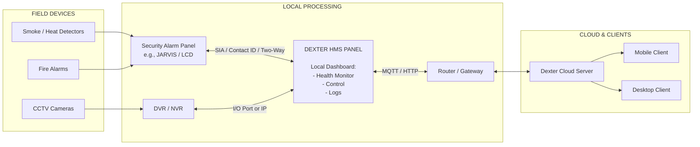
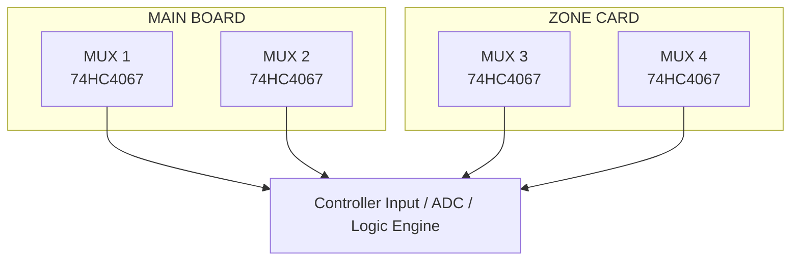
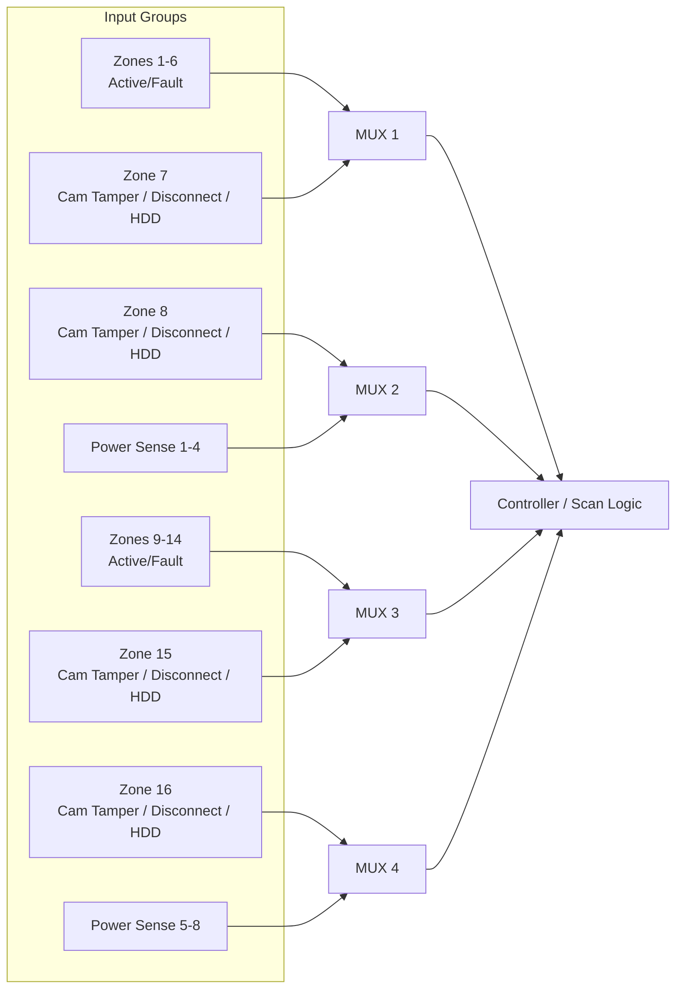
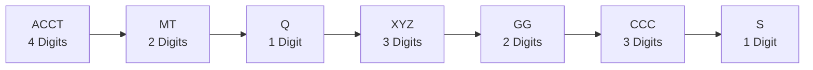
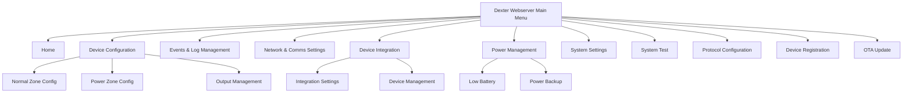
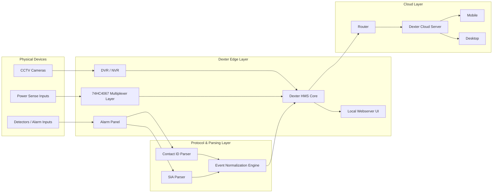

# Dexter HMS — Detailed Architecture, Logic, Protocol, and Webserver Reference

## Document Metadata
- System: Dexter Health Monitoring System (HMS)
- Scope: Cloud architecture, multiplexer input logic, Contact ID protocol, and webserver UI architecture
- Purpose: Technical documentation, RAG training, troubleshooting, and system onboarding
- Format: Markdown with detailed text and Mermaid diagrams

---

# 1. Dexter HMS Cloud Architecture

## 1.1 System Overview

The Dexter Health Monitoring System (HMS) acts as an intelligent bridge between field security/fire infrastructure and a centralized cloud platform.

It gathers data from:
- security alarm panels
- fire alarm panels
- CCTV subsystems through DVR/NVR
- local health and diagnostics sources
- power and communication monitoring circuits

The HMS panel performs:
- local device health monitoring
- event collection and logging
- communication with cloud infrastructure
- local dashboard presentation
- remote monitoring enablement for desktop and mobile clients

---

## 1.2 High-Level Architecture



---

## 1.3 Expanded Signal Path

### Fire / Alarm Path
1. Smoke detectors, heat detectors, or alarm peripherals generate events.
2. Events are received by the security or fire alarm panel.
3. The alarm panel communicates event details to the Dexter HMS panel using supported alarm communication methods such as:
   - SIA
   - Contact ID
   - other two-way integration methods
4. Dexter HMS logs the event and updates its local dashboard.
5. HMS forwards status, health, and alarm data to the cloud server via router using MQTT or HTTP.
6. Mobile and desktop users receive visibility through the cloud dashboard.

### CCTV Health Path
1. CCTV cameras connect to the DVR/NVR.
2. DVR/NVR exposes health or status over I/O or IP.
3. Dexter HMS reads health conditions such as:
   - camera tamper
   - camera disconnection
   - HDD fault
4. HMS logs, displays, and uploads these health states to the cloud platform.

---

## 1.4 Detailed Logical Block Diagram

```text
+----------------------+         +-----------------------------+
|  Smoke/Heat Sensors  |         |      CCTV Cameras           |
+----------+-----------+         +--------------+--------------+
           |                                        |
           v                                        v
+----------------------+                  +----------------------+
| Security/Fire Panel  |                  |      DVR / NVR       |
|  (JARVIS / LCD etc.) |                  |  Camera Health I/O   |
+----------+-----------+                  +----------+-----------+
           |                                         |
           | SIA / CONTACT ID / 2-WAY               | I/O Port or IP
           v                                         v
                 +------------------------------------------+
                 |          DEXTER HMS PANEL                |
                 |------------------------------------------|
                 | Local Dashboard                          |
                 | - Health Monitor                         |
                 | - Control                                |
                 | - Logs                                   |
                 |------------------------------------------|
                 | Core roles                               |
                 | - Event collection                       |
                 | - Health polling                         |
                 | - Local alarm state normalization        |
                 | - Cloud communication                    |
                 +-------------------+----------------------+
                                     |
                                     | MQTT / HTTP
                                     v
                            +----------------------+
                            |   Router / Gateway   |
                            +----------+-----------+
                                       |
                                       v
                            +----------------------+
                            | Dexter Cloud Server  |
                            +----------+-----------+
                                       |
                         +-------------+-------------+
                         |                           |
                         v                           v
                 +---------------+           +---------------+
                 | Mobile Client |           | Desktop Client|
                 +---------------+           +---------------+
```

---

## 1.5 Functional Responsibilities

| Layer | Main Function |
|------|---------------|
| Field Devices | Generate alarm, fire, or camera health signals |
| Alarm Panel | Aggregates zone events and transmits standard protocol messages |
| DVR/NVR | Collects video device status and camera-related faults |
| HMS Panel | Central health processor, event logger, local dashboard, cloud uplink |
| Router | Provides IP connectivity to the cloud |
| Cloud Server | Remote storage, dashboards, notifications, device fleet visibility |
| Clients | Mobile and desktop access for operators and administrators |

---

# 2. Dexter Panel Multiplexer (74HC4067) Input Logic

## 2.1 Overview

The Dexter panel uses multiple **74HC4067 analog multiplexers** to expand the number of monitored inputs while minimizing direct MCU pin consumption.

Each multiplexer routes one of many input channels into the controller’s sensing path.  
These inputs represent:
- zone active states
- zone fault states
- camera tamper conditions
- camera disconnect conditions
- HDD error conditions
- power sense conditions

The architecture is split between:
- **main board**
- **zone card**

---

## 2.2 Multiplexer Allocation Summary

| MUX | Physical Location | Main Use |
|-----|-------------------|----------|
| MUX 1 | Main Board | Zone 1 to Zone 7 related logic |
| MUX 2 | Main Board | Zone 8 and Power Sense 1 to 4 |
| MUX 3 | Zone Card | Zone 9 to Zone 15 related logic |
| MUX 4 | Zone Card | Zone 16 and Power Sense 5 to 8 |

---

## 2.3 Detailed MUX Architecture



---

## 2.4 MUX 1 — Main Board Mapping

### Purpose
MUX 1 handles the first block of monitored zone signals on the main board.

```text
MUX 1 — MAIN BOARD
------------------
X0  -> Zone 1 Active
X1  -> Zone 1 Fault
X2  -> Zone 2 Active
X3  -> Zone 2 Fault
X4  -> Zone 3 Active
X5  -> Zone 3 Fault
X6  -> Zone 4 Active
X7  -> Zone 4 Fault
X8  -> Zone 5 Active
X9  -> Zone 5 Fault
X10 -> Zone 6 Active
X11 -> Zone 6 Fault
X12 -> Zone 7 Camera Tamper
X13 -> Zone 7 Camera Disconnect
X14 -> Zone 7 HDD Error
X15 -> Reserved / Unused / Future
```

---

## 2.5 MUX 2 — Main Board Mapping

```text
MUX 2 — MAIN BOARD
------------------
X0  -> Zone 8 Camera Tamper
X1  -> Zone 8 Camera Disconnect
X2  -> Zone 8 HDD Error
X3  -> Power Sense 1
X4  -> Power Sense 2
X5  -> Power Sense 3
X6  -> Power Sense 4
X7  -> Reserved
X8  -> Reserved
X9  -> Reserved
X10 -> Reserved
X11 -> Reserved
X12 -> Reserved
X13 -> Reserved
X14 -> Reserved
X15 -> Reserved
```

---

## 2.6 MUX 3 — Zone Card Mapping

```text
MUX 3 — ZONE CARD
-----------------
X0  -> Zone 9 Active
X1  -> Zone 9 Fault
X2  -> Zone 10 Active
X3  -> Zone 10 Fault
X4  -> Zone 11 Active
X5  -> Zone 11 Fault
X6  -> Zone 12 Active
X7  -> Zone 12 Fault
X8  -> Zone 13 Active
X9  -> Zone 13 Fault
X10 -> Zone 14 Active
X11 -> Zone 14 Fault
X12 -> Zone 15 Camera Tamper
X13 -> Zone 15 Camera Disconnect
X14 -> Zone 15 HDD Error
X15 -> Reserved / Unused / Future
```

---

## 2.7 MUX 4 — Zone Card Mapping

```text
MUX 4 — ZONE CARD
-----------------
X0  -> Zone 16 Camera Tamper
X1  -> Zone 16 Camera Disconnect
X2  -> Zone 16 HDD Error
X3  -> Power Sense 5
X4  -> Power Sense 6
X5  -> Power Sense 7
X6  -> Power Sense 8
X7  -> Reserved
X8  -> Reserved
X9  -> Reserved
X10 -> Reserved
X11 -> Reserved
X12 -> Reserved
X13 -> Reserved
X14 -> Reserved
X15 -> Reserved
```

---

## 2.8 Full MUX Logic Diagram



---

## 2.9 Typical Scan Logic

The controller typically:
1. drives the mux select lines
2. samples one channel at a time
3. maps the sampled value to a zone condition
4. updates local health state
5. raises event logs if status changes
6. forwards relevant changes to cloud or protocol layers

---

# 3. Ademco Contact ID Message Structure

## 3.1 Overview

Contact ID is a standard DTMF-based alarm reporting format used by security and fire panels to transmit event information to receivers.

It is commonly used for:
- intrusion alarms
- fire alarms
- tamper events
- system restore messages
- open/close reports
- supervisory or status reporting

Dexter HMS may interface with alarm panels that output Contact ID messages or derived events.

---

## 3.2 Message Format

```text
Message Format:
ACCT MT Q XYZ GG CCC S
```

Where the standard logical fields are:

| Field | Length | Meaning |
|------|--------|---------|
| ACCT | 4 | Account number |
| MT | 2 | Message type |
| Q | 1 | Event qualifier |
| XYZ | 3 | Event code |
| GG | 2 | Group or partition number |
| CCC | 3 | Zone number or user number |
| S | 1 | Checksum |

---

## 3.3 Detailed Field Breakdown

### ACCT — Account Number
- 4 digits
- identifies the subscriber or panel account
- valid characters may include 0–9 and B–F depending on implementation

### MT — Message Type
Usually one of:
- 18
- 98

This indicates the message framing type used in Contact ID transmission.

### Q — Event Qualifier
Defines the event class:
- `1` = new event / alarm
- `3` = restore
- `6` = status report

### XYZ — Event Code
Three-digit event code indicating event type.

Examples:
- `131` = perimeter burglary
- `401` = opening/closing by user (depending on context)
- fire and supervisory events may use other standard ranges

### GG — Group / Partition
- partition number
- `00` if not applicable

### CCC — Zone / User / Point
- zone number
- device number
- user number
- `000` if not applicable

### S — Checksum
- 1 digit
- computed using modulo-15 style checksum logic as defined by Contact ID implementation

---

## 3.4 Contact ID Structural Diagram



---

## 3.5 Message Example

```text
1234 18 1 131 01 005 7
```

### Interpreted Meaning
- Account: `1234`
- Message type: `18`
- Qualifier: `1` → new event
- Event code: `131` → perimeter burglary
- Group: `01`
- Zone: `005`
- Checksum: `7`

Meaning:  
A new burglary-related event has occurred on partition 1, zone 5, for account 1234.

---

## 3.6 Contact ID Flow in Dexter Context

```text
Detector / Sensor Event
        |
        v
Alarm Panel
        |
        | DTMF Contact ID
        v
HMS Interface / Alarm Integration Layer
        |
        v
Event Parser
        |
        v
Zone / Health / Alarm Mapping
        |
        v
Log Storage + Dashboard + Cloud Uplink
```

---

# 4. Dexter Webserver UI Architecture

## 4.1 Overview

The Dexter webserver provides a browser-based management interface for:
- statistics and health dashboards
- zone configuration
- event and logs review
- network communication settings
- third-party device integration
- testing and maintenance
- provisioning and firmware updates

---

## 4.2 Navigation Hierarchy



---

## 4.3 Expanded UI Map

```text
DEXTER WEBSERVER MAIN MENU
|
+-- Home
|   +-- Device Statistics Dashboard
|   +-- Live Status Summary
|   +-- Device Health Snapshot
|
+-- Device Configuration
|   +-- Normal Zone Config
|   |   +-- Zone type
|   |   +-- Zone label
|   |   +-- Enable / Disable
|   |   +-- Fault behavior
|   |
|   +-- Power Zone Config
|   |   +-- Power source mapping
|   |   +-- Threshold settings
|   |   +-- Backup source behavior
|   |
|   +-- Output Management
|       +-- Relay output mapping
|       +-- Alarm output behavior
|       +-- Trigger logic
|
+-- Events & Log Management
|   +-- Alarm Events
|   +-- Fault Logs
|   +-- Restore Logs
|   +-- Audit Trail
|
+-- Network & Comms Settings
|   +-- IP Configuration
|   +-- MQTT Settings
|   +-- HTTP Settings
|   +-- Cloud Endpoint
|
+-- Device Integration
|   +-- Integration Settings
|   |   +-- NVR Integration
|   |   +-- BACS Integration
|   |
|   +-- Device Management
|       +-- Future Device Enrollment
|
+-- Power Management
|   +-- Low Battery
|   +-- Power Backup
|   +-- Power Health Monitoring
|
+-- System Settings
|   +-- Advanced Functions
|   +-- Global Parameters
|   +-- Date / Time
|   +-- Service Settings
|
+-- System Test
|   +-- Lamp Test
|   +-- Relay Test
|   +-- Buzzer Test
|
+-- Protocol Configuration
|   +-- Contact ID
|   +-- SIA
|   +-- Other Interface Parameters
|
+-- Device Registration
|   +-- Provisioning
|   +-- Serial / Device ID Binding
|
+-- OTA Update
    +-- Firmware Upload
    +-- Version Check
    +-- Upgrade Execution
```

---

## 4.4 UI Functional Grouping

| Section | Purpose |
|--------|---------|
| Home | Live overview and statistics |
| Device Configuration | Zone, power, and output setup |
| Events & Log Management | Event review and diagnostics |
| Network & Comms | Cloud and network connectivity |
| Device Integration | External platform integration |
| Power Management | Battery and backup status |
| System Settings | Advanced system control |
| System Test | Maintenance and verification |
| Protocol Configuration | Alarm protocol setup |
| Device Registration | Device provisioning |
| OTA Update | Firmware lifecycle management |

---

# 5. Combined End-to-End Architecture

## 5.1 Unified System View



---

## 5.2 Data Flow Summary

| Source | Intermediate Layer | HMS Role | Output |
|--------|--------------------|----------|--------|
| Detectors | Alarm Panel | Parse alarm protocols | Local and cloud event visibility |
| Cameras | DVR/NVR | Read health status | Camera fault tracking |
| Power Inputs | Multiplexer + logic scan | Monitor power health | Power alerts and logs |
| User Config | Webserver | Store and apply settings | Updated device behavior |

---

# 6. RAG Training Notes

## 6.1 Best Retrieval Keywords

```text
Dexter HMS cloud architecture
Dexter multiplexer 74HC4067 zone mapping
Dexter Contact ID message format
Dexter webserver navigation hierarchy
Dexter alarm panel integration
Dexter CCTV health monitoring
Dexter MQTT HTTP cloud flow
Dexter zone card mux input logic
```

## 6.2 Example User Questions Supported by This Document

- How does Dexter HMS connect to the cloud?
- What protocols are used between the alarm panel and HMS?
- Which mux handles Zone 15 HDD error?
- What does the Contact ID field XYZ represent?
- Where is Power Sense 6 mapped?
- What menu contains protocol configuration in Dexter webserver?
- How are CCTV health events routed into HMS?

---

# 7. Troubleshooting Pointers

| Symptom | Possible Cause |
|--------|----------------|
| No cloud updates | Router, MQTT/HTTP settings, or cloud endpoint issue |
| Missing zone states | Mux scan issue or wrong channel mapping |
| Contact ID events not decoding | Protocol parse or field framing issue |
| Camera faults not visible | DVR/NVR integration or IP/I/O link issue |
| Web menu inaccessible | Local webserver or network configuration issue |

---

# End of Document
