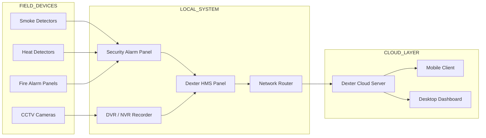
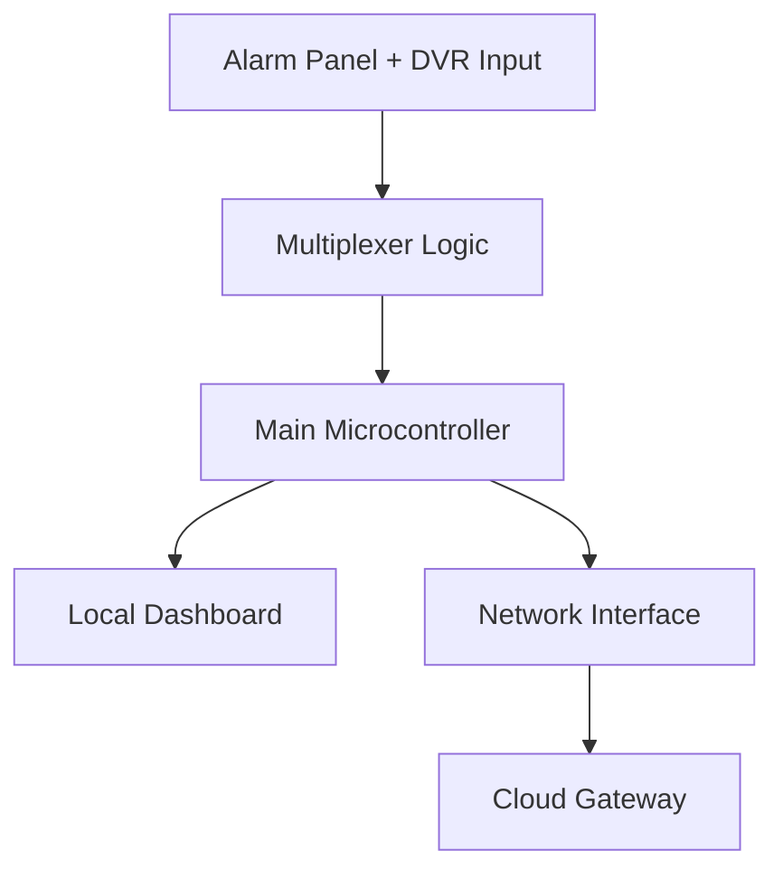
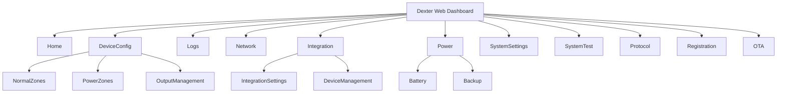
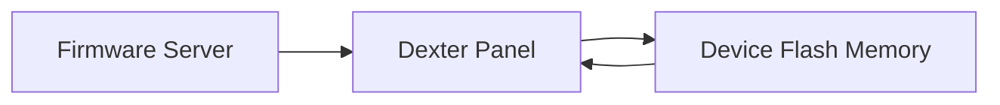
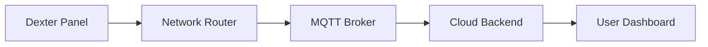
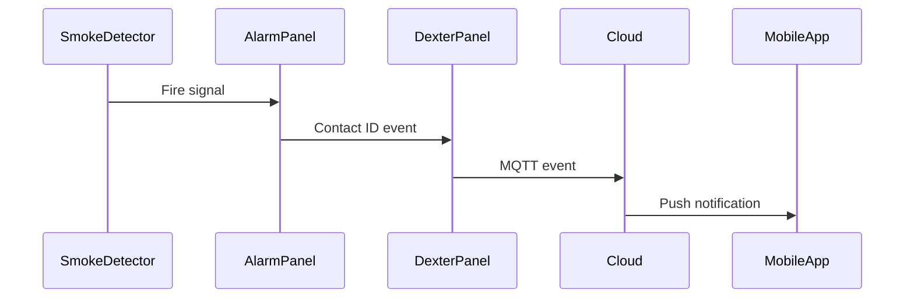

# Dexter HMS — System Architecture & Protocol Reference

## Document Metadata

* System: Dexter Health Monitoring System (HMS)
* Category: Industrial Security & Monitoring Platform
* Protocols: MQTT, HTTP, Contact ID, SIA
* Version: 1.0
* Purpose: Architecture documentation and knowledge base for AI retrieval systems

---

# 1. System Overview

The **Dexter Health Monitoring System (HMS)** is an integrated platform used to monitor and manage security and fire alarm infrastructure in real time.

The system architecture connects **field devices**, **local processing panels**, and a **cloud-based monitoring server**.

Core capabilities include:

* Alarm monitoring
* CCTV health monitoring
* Device diagnostics
* Event logging
* Remote device control
* Cloud-based visualization

The HMS system acts as a **bridge between security hardware and cloud infrastructure**.

---

# 2. High-Level System Architecture



---

# 3. Field Device Layer

The field layer consists of sensors and monitoring devices deployed in the facility.

| Device           | Function                          |
| ---------------- | --------------------------------- |
| Smoke Detector   | Detects combustion particles      |
| Heat Detector    | Detects abnormal temperature rise |
| Fire Alarm Panel | Aggregates fire zone alerts       |
| CCTV Camera      | Video monitoring                  |
| DVR/NVR          | Video recording and management    |

---

# 4. Local Processing Layer

The **Dexter HMS Panel** performs edge-level processing.

### Responsibilities

* Collect alarm panel events
* Monitor CCTV device health
* Maintain device logs
* Provide a local dashboard
* Transmit data to the cloud

### Dexter Panel Internal Modules



---

# 5. Dexter Panel Multiplexer Architecture

The Dexter board uses **74HC4067 analog multiplexers** to expand input capacity.

Each multiplexer can manage **16 input channels**.

---

## Multiplexer Layout

| Multiplexer | Location   | Purpose                    |
| ----------- | ---------- | -------------------------- |
| MUX1        | Main Board | Zones 1–7                  |
| MUX2        | Main Board | Zone 8 + Power Monitoring  |
| MUX3        | Zone Card  | Zones 9–15                 |
| MUX4        | Zone Card  | Zone 16 + Power Monitoring |

---

## Detailed Multiplexer Logic

### MUX 1 — Main Board

```text
X0   Zone1 Active
X1   Zone1 Fault
X2   Zone2 Active
X3   Zone2 Fault
X4   Zone3 Active
X5   Zone3 Fault
X6   Zone4 Active
X7   Zone4 Fault
X8   Zone5 Active
X9   Zone5 Fault
X10  Zone6 Active
X11  Zone6 Fault
X12  Camera Tamper
X13  Camera Disconnect
X14  HDD Error
```

---

### MUX 2 — Main Board

```text
X0 Camera Tamper
X1 Camera Disconnect
X2 HDD Error

X3 Power Sense 1
X4 Power Sense 2
X5 Power Sense 3
X6 Power Sense 4
```

---

### MUX 3 — Zone Card

```text
X0  Zone9 Active
X1  Zone9 Fault
X2  Zone10 Active
X3  Zone10 Fault
X4  Zone11 Active
X5  Zone11 Fault
X6  Zone12 Active
X7  Zone12 Fault

X8  Zone13 Active
X9  Zone13 Fault
X10 Zone14 Active
X11 Zone14 Fault

X12 Camera Tamper
X13 Camera Disconnect
X14 HDD Error
```

---

### MUX 4 — Zone Card

```text
X0 Camera Tamper
X1 Camera Disconnect
X2 HDD Error

X3 Power Sense 5
X4 Power Sense 6
X5 Power Sense 7
X6 Power Sense 8
```

---

# 6. Contact ID Protocol

The Dexter system supports **Ademco Contact ID**, a widely used alarm communication protocol.

Contact ID transmits alarm events using **DTMF tones** over phone or IP channels.

---

## Message Structure

```text
ACCT MT Q XYZ GG CCC S
```

| Field | Length | Description      |
| ----- | ------ | ---------------- |
| ACCT  | 4      | Account number   |
| MT    | 2      | Message type     |
| Q     | 1      | Event qualifier  |
| XYZ   | 3      | Event code       |
| GG    | 2      | Partition number |
| CCC   | 3      | Zone/User        |
| S     | 1      | Checksum         |

---

## Example Message

```text
1234 18 1 131 00 004 7
```

Interpretation:

| Field        | Meaning            |
| ------------ | ------------------ |
| Account      | 1234               |
| Message Type | Alarm event        |
| Qualifier    | New event          |
| Event Code   | Perimeter burglary |
| Partition    | 00                 |
| Zone         | 004                |
| Checksum     | 7                  |

---

# 7. Dexter Webserver Architecture

The Dexter panel includes an embedded web server used for configuration and monitoring.

---

## Web Interface Structure



---

## Main UI Modules

### Home Dashboard

Displays:

* device health
* alarm status
* connection status
* recent events

---

### Device Configuration

Used to configure zone behavior.

| Configuration     | Description             |
| ----------------- | ----------------------- |
| Normal Zone       | Standard alarm inputs   |
| Power Zone        | Power monitoring inputs |
| Output Management | Relay outputs           |

---

### Event Log

Stores system history.

Events include:

* intrusion alarms
* fire alarms
* device faults
* communication errors

---

### Network Settings

Network configuration options:

* static IP
* DHCP
* gateway configuration
* DNS configuration

---

### Device Integration

Used for integrating external systems.

Examples:

* NVR integration
* BACS building automation

---

### System Test

Used for hardware verification.

Tests available:

| Test        | Purpose            |
| ----------- | ------------------ |
| Lamp Test   | LED verification   |
| Relay Test  | Output relay check |
| Buzzer Test | Audio alarm check  |

---

### Protocol Configuration

Communication protocols supported:

* MQTT
* HTTP REST
* Contact ID
* SIA

---

### Device Registration

Registers device to cloud.

Registration includes:

* device ID
* authentication token
* cloud endpoint

---

### OTA Update

Supports firmware upgrades remotely.

Process:



---

# 8. Cloud Communication Layer

Dexter panels communicate with the cloud using standard IoT protocols.

---

## Communication Architecture



---

## Communication Protocols

| Protocol   | Purpose                      |
| ---------- | ---------------------------- |
| MQTT       | Real-time device telemetry   |
| HTTP       | Configuration APIs           |
| Contact ID | Alarm events                 |
| SIA        | Security alarm communication |

---

# 9. Data Flow Example

Example event: **Fire alarm triggered**



---

# 10. AI Knowledge Retrieval Keywords

These keywords improve semantic retrieval in RAG systems.

```
dexter hms architecture
dexter multiplexer logic
74hc4067 zone mapping
contact id alarm message format
dexter webserver ui structure
dexter cloud communication
alarm panel cloud monitoring
industrial security monitoring system
```

---

# End of Document
