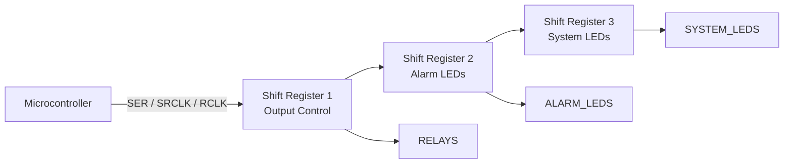
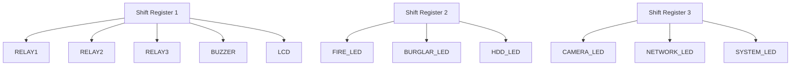
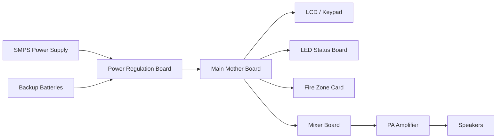
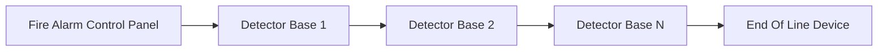
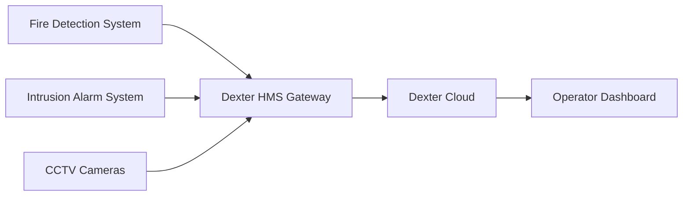

# Dexter HMS & Security Systems Architecture

### Shift Register Logic • Pinnacle System • Fire Detector Wiring • Cloud Dashboard

---

# 1. Dexter HMS Shift Register Logic (74HC595)

## 1.1 Overview

The **Dexter HMS panel** uses **74HC595 serial-in parallel-out shift registers** to control multiple hardware outputs using minimal MCU pins.

This architecture allows the controller to manage:

* relay outputs
* internal buzzer
* external buzzer
* LCD backlight
* diagnostic LEDs
* system status indicators

Three shift registers are chained to expand the output bus.

---

## 1.2 Shift Register Architecture



---

## 1.3 Shift Register 1 — Relay & Control Outputs

```text
SHIFT REGISTER 1
(74HC595)

Bit 0  -> Relay 1 (Tamper / System Off)
Bit 1  -> Relay 2 (Fault Condition)
Bit 2  -> Relay 3 (Trigger Condition)
Bit 3  -> Internal Buzzer
Bit 4  -> Remote LED 1
Bit 5  -> Remote Buzzer
Bit 6  -> LCD Backlight
Bit 7  -> Reserved
```

### Hardware Mapping

| Bit | Output          | Function                 |
| --- | --------------- | ------------------------ |
| 0   | Relay 1         | System tamper indication |
| 1   | Relay 2         | Fault indication         |
| 2   | Relay 3         | Alarm trigger            |
| 3   | Internal buzzer | Audible alert            |
| 4   | Remote LED      | External indicator       |
| 5   | Remote buzzer   | External audible         |
| 6   | LCD backlight   | Display illumination     |

---

## 1.4 Shift Register 2 — Fire & Burglar Panel LEDs

```text
SHIFT REGISTER 2

Bit 8  -> Fire Panel Fault LED (Yellow)
Bit 9  -> Fire Panel Active LED (Red)
Bit 10 -> Fire Panel ON LED (Green)
Bit 11 -> Burglar Panel Fault LED (Yellow)
Bit 12 -> Burglar Panel Active LED (Red)
Bit 13 -> Burglar Panel ON LED (Green)
Bit 14 -> HDD Error LED
Bit 15 -> Reserved
```

---

## 1.5 Shift Register 3 — Camera & Network LEDs

```text
SHIFT REGISTER 3

Bit 16 -> Camera Disconnect LED
Bit 17 -> Camera Tamper LED
Bit 18 -> Network Status LED
Bit 19 -> 4G LTE LED
Bit 20 -> System Healthy LED
Bit 21 -> NVR / DVR ON LED
Bit 22 -> Mains Power ON LED
Bit 23 -> Reserved
```

---

## 1.6 Complete LED Control Map



---

# 2. Pinnacle 20-Zone System Architecture

## 2.1 System Overview

The **Pinnacle system** integrates:

* fire alarm monitoring
* public address audio distribution
* evacuation messaging

The platform includes:

* motherboard controller
* fire zone card
* audio mixer
* amplifier
* LED board
* keypad interface

---

## 2.2 System Architecture



---

## 2.3 Hardware Interconnection

```text
+------------------+
| SMPS POWER SUPPLY|
+------------------+
        |
        v
+----------------------+
| POWER REGULATION BD |
+----------------------+
        |
        v
+----------------------+
| MAIN MOTHER BOARD    |
+----------------------+

 34 PIN -> LCD / KEYPAD
 20 PIN -> LED BOARD
 16 PIN -> FIRE ZONE CARD
 20 PIN -> MIXER BOARD

 MIXER BOARD -> AUDIO AMP -> SPEAKERS
 MICROPHONE -> MIXER BOARD
```

---

## 2.4 Audio Flow

```text
Microphone
    │
    ▼
Mixer Board
    │
    ▼
Power Amplifier
    │
    ▼
Zone Speaker Distribution
```

---

# 3. System Sensor 2-Wire Detector Loop

## 3.1 System Overview

Two-wire smoke detectors combine:

* power supply
* alarm signalling

within the same loop.

The loop connects detectors sequentially and ends with an **End-of-Line resistor or module**.

---

## 3.2 Loop Architecture



---

## 3.3 Wiring Diagram

```text
+-----------------------------+
| FIRE ALARM CONTROL PANEL    |
+-----------------------------+

     (+) Line        (-) Line
        |                |
        v                v

+----------------------------------+
| DETECTOR BASE 1                  |
|                                  |
| (+) Power IN                     |
| (-) Power IN/OUT                 |
| (+) Power OUT                    |
| Remote Annunciator +             |
+----------------------------------+

        |
        v

+----------------------------------+
| DETECTOR BASE 2                  |
|                                  |
| (+) Power IN                     |
| (-) Power IN/OUT                 |
| (+) Power OUT                    |
+----------------------------------+

        |
        v

+----------------------------+
| END OF LINE DEVICE (EOL)   |
+----------------------------+
```

---

## 3.4 Loop Monitoring Logic

The fire control panel detects:

| Condition     | Detection               |
| ------------- | ----------------------- |
| Alarm         | Current spike           |
| Open circuit  | Infinite resistance     |
| Short circuit | Low resistance          |
| Normal        | Expected loop impedance |

---

# 4. Dexter Cloud Dashboard Data Architecture

## 4.1 System Overview

The **Dexter Cloud Dashboard** collects operational telemetry from gateway devices deployed at each branch location.

These gateways aggregate:

* alarm systems
* CCTV systems
* building automation
* access control
* telemetry sensors

---

## 4.2 Cloud Data Flow


---

## 4.3 Dashboard Data Hierarchy

```text
DEXTER CLOUD DASHBOARD

Entity Overview
 ├ Branch Code
 ├ Gateway Status
 ├ CCTV Status
 ├ IAS Status
 ├ BAS Status
 ├ FAS Status
 └ ACS Status


Gateway Telemetry
 ├ Weekly Uptime
 ├ Alarm Count
 ├ AC Voltage Monitoring
 ├ DC Current Monitoring
 └ Battery Health


CCTV Diagnostics
 ├ Total Cameras
 ├ Active Cameras
 ├ Storage Capacity
 ├ Camera Resolution
 ├ FPS Monitoring
 └ Tamper / Disconnect Logs
```

---

## 4.4 Example Telemetry Model

| Metric           | Example Threshold    |
| ---------------- | -------------------- |
| AC Voltage       | 100V / 220V / 270V   |
| DC Current       | 2A / 5A              |
| Battery Voltage  | 14V / 15V            |
| Camera Count     | Active vs Installed  |
| Storage Capacity | Used TB / Free Slots |

---

# 5. End-to-End System Integration



---

# 6. RAG Training Keywords

```text
Dexter HMS shift register LED mapping
74HC595 relay control logic
Pinnacle fire PA system architecture
System Sensor 2-wire smoke detector loop
Dexter cloud dashboard telemetry
security monitoring gateway architecture
CCTV health monitoring system
industrial alarm monitoring architecture
```

---

# End of Document
