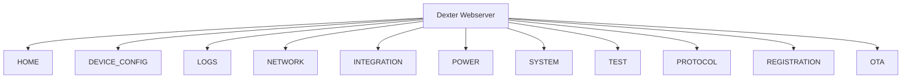
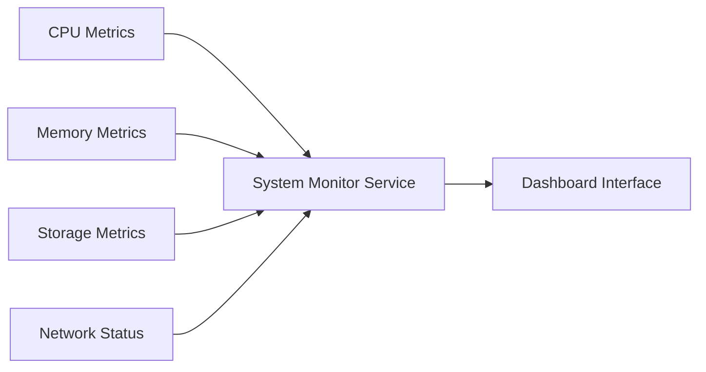
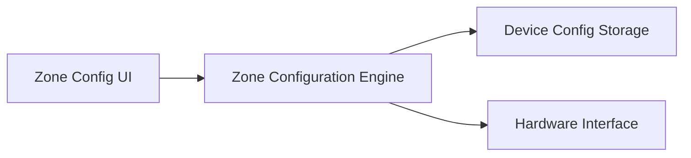
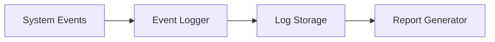
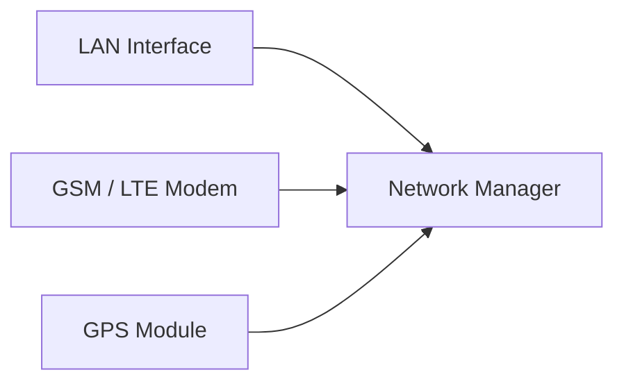
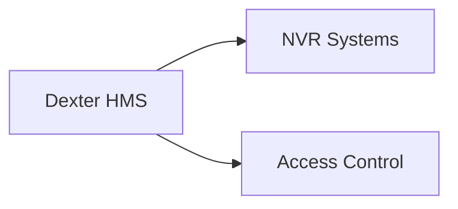
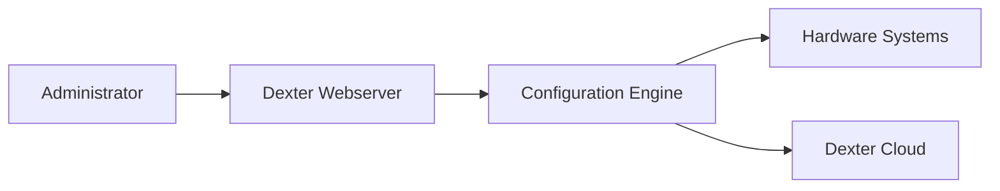

# Dexter HMS Webserver Architecture & Configuration Flow

## Document Scope

This document describes the **complete architecture and navigation flow** of the **Dexter HMS Webserver Management Interface**.

The web interface provides configuration and monitoring capabilities for the Dexter HMS gateway, including:

* system diagnostics
* zone configuration
* event logs
* network configuration
* device integration
* firmware updates

The interface is designed for **administrators, system integrators, and field engineers**.

---

# 1. Dexter Webserver Architecture

## 1.1 System Architecture Overview


---

## 1.2 Component Layers

| Layer           | Description                               |
| --------------- | ----------------------------------------- |
| User Interface  | Web dashboard accessed through browser    |
| Webserver       | Local device HTTP server                  |
| System Services | Device monitoring, event engine           |
| Hardware Layer  | Sensors, alarm panels, DVR, power systems |

---

# 2. Main Navigation Hierarchy

## 2.1 Root Menu Structure



---

# 3. Home Dashboard

## 3.1 Dashboard Overview

The **Home screen** provides real-time device telemetry.

### Display Metrics

| Metric             | Description             |
| ------------------ | ----------------------- |
| CPU Utilization    | Processor load          |
| Memory Used        | RAM usage               |
| Disk Used          | Storage usage           |
| Serial Number      | Device identity         |
| Network Mode       | LAN / GSM / LTE         |
| System Uptime      | Time since last reboot  |
| CPU Temperature    | Processor thermal state |
| Network Interfaces | Active interface list   |
| CPU Frequency      | Clock speed             |

---

## 3.2 Dashboard Data Flow



---

# 4. Device Configuration

## 4.1 Zone Configuration Architecture

Dexter supports **multiple integrated subsystems**.

Supported zones:

* BAS (Building Automation)
* FAS (Fire Alarm System)
* IAS (Intrusion Alarm System)
* CCTV
* BACS (Access Control)
* Time Lock

---

## 4.2 Zone Configuration Flow



---

## 4.3 Normal Zone Config

Zones **1–16**

| Zone   | Type      |
| ------ | --------- |
| Zone 1 | BAS       |
| Zone 2 | FAS       |
| Zone 3 | Time Lock |
| Zone 4 | BACS      |
| Zone 5 | IAS       |
| Zone 6 | CCTV      |

Each zone supports:

* enable / disable
* alarm mapping
* device linking

---

## 4.4 Power Zone Config

Zones **1–8**

Power monitoring includes:

| Parameter      | Example |
| -------------- | ------- |
| AC Voltage     | 220V    |
| DC Current     | 2A      |
| Battery Health | 14V     |

---

## 4.5 Output Management

Controls system outputs.

Examples:

| Output     | Function |
| ---------- | -------- |
| Relay 1    | Tamper   |
| Relay 2    | Fault    |
| Relay 3    | Alarm    |
| Buzzer     | Alert    |
| Remote LED | Status   |

Additional features:

* integration toggles
* relay configuration
* buffer clearing

---

# 5. Events & Log Management

## 5.1 Logging Architecture



---

## 5.2 Log Features

| Feature       | Description              |
| ------------- | ------------------------ |
| Download Logs | Export diagnostic logs   |
| Clear Logs    | Reset log buffer         |
| Tabular View  | Structured event display |
| Event Reports | Generate daily reports   |

---

# 6. Network & Communication Settings

## 6.1 Communication Architecture



---

## 6.2 Connectivity Settings

| Setting      | Description          |
| ------------ | -------------------- |
| eSIM Mode    | Cloud connectivity   |
| Physical SIM | Cellular fallback    |
| GNSS         | Location tracking    |
| LAN          | Local network access |

---

## 6.3 Device Credentials

Required credentials include:

* Client ID
* Username
* Password
* SOL ID

These credentials authenticate the device with the cloud platform.

---

# 7. Device Integration

## 7.1 Supported Integrations

| System         | Vendor         |
| -------------- | -------------- |
| CCTV           | Hikvision      |
| CCTV           | Dahua          |
| Access Control | Hikvision BACS |

---

## 7.2 Integration Architecture



---

# 8. Power Management

Planned features include:

* battery monitoring
* backup runtime tracking
* power fault alerts

---

# 9. System Settings

## 9.1 General Settings

Includes:

* brand information
* site details
* date/time
* password management

---

## 9.2 Maintenance Operations

| Operation       | Description         |
| --------------- | ------------------- |
| Restart System  | Reboot gateway      |
| Shutdown System | Safe shutdown       |
| Factory Reset   | Reset configuration |

---

# 10. System Test

Planned diagnostics include:

| Test        | Purpose                  |
| ----------- | ------------------------ |
| Lamp Test   | LED diagnostics          |
| Relay Test  | Output verification      |
| Buzzer Test | Alarm audio verification |

---

# 11. Device Registration

## 11.1 Provisioning Flow


---

# 12. OTA Firmware Update

Firmware updates allow remote device upgrades.


---

# 13. Complete System Flow



---

# 14. RAG Training Keywords

```
Dexter webserver configuration
Dexter HMS dashboard architecture
Dexter zone configuration system
Dexter network configuration interface
Dexter device integration Hikvision
Dexter cloud provisioning flow
Dexter firmware OTA update
Dexter alarm monitoring gateway UI
```

---

# End of Document
