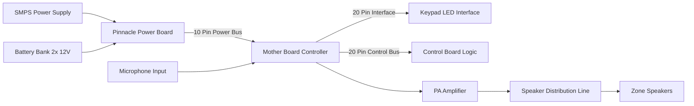

# Dhwani PA Console Detailed Block Diagram


# Detailed Power Distribution Diagram
mermaid
flowchart TD

A[AC Mains Input]

A --> B[SMPS Power Supply]

B --> C[DC Output Bus]

D[Battery Backup System]

D --> C

C --> E[Pinnacle Power Board]

E --> F[Mother Board]
E --> G[Control Board]
E --> H[PA Amplifier]
E --> I[Keypad LED Board]


```
```
# Internal Communication Bus

mermaid
flowchart TD

A[Mother Board]

A -->|20 Pin| B[Control Board]

A -->|20 Pin| C[Keypad LED Board]

A -->|Audio Line| D[PA Amplifier]

A -->|Speaker Line| E[Speaker Output]
```
```
# System Workflow

1. **SMPS and Battery supply power** to the system.
2. Power is distributed through the **Pinnacle Power Board**.
3. The **Mother Board acts as the central controller**.
4. Microphone audio enters the **audio processing path**.
5. The signal is routed to the **PA amplifier**.
6. Amplified audio is distributed to **speaker zones**.
7. User interaction is done through **control board and keypad LED board**.

---

# Result

This documentation now contains:

✔ Power architecture  
✔ Audio signal path  
✔ Internal communication bus  
✔ Control interface layout  
✔ Full PA console architecture  

---

If you want, I can also create **3 extremely useful diagrams for PA systems** that would make this documentation **much more professional**:

1. **Dhwani PA Console PCB Interconnection Diagram**
2. **PA System Audio Signal Processing Pipeline**
3. **Multi-Zone Speaker Distribution Architecture**

These are usually used in **audio engineering manuals and system integration documents**.