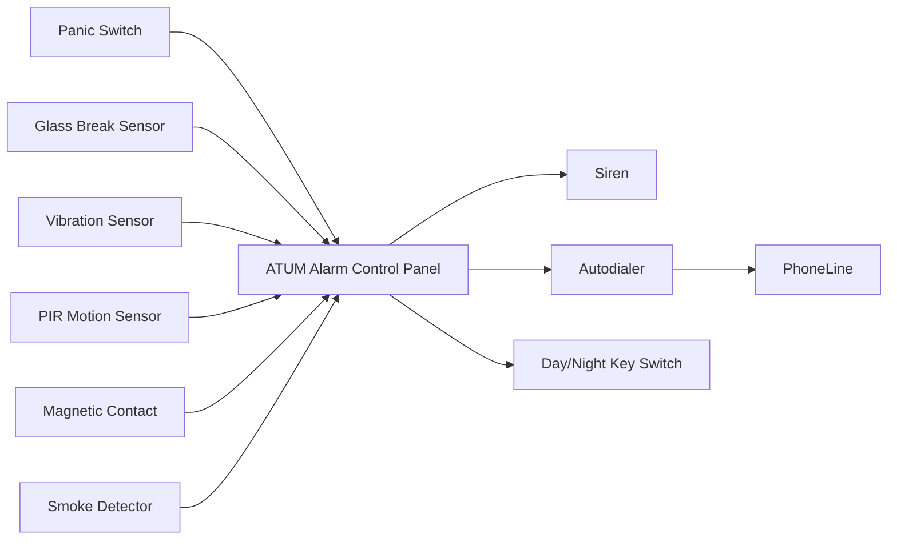
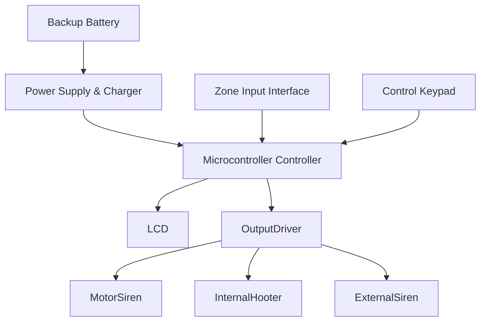
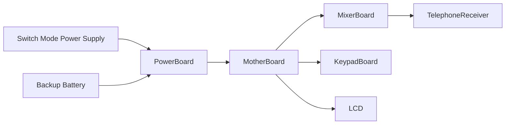
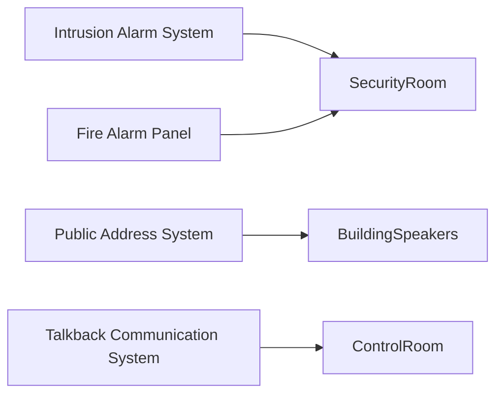

# Industrial Security & Fire Systems — Architecture and Wiring Reference

## Document Purpose

This document describes the architecture, wiring layout, and signal flow of multiple industrial safety and communication systems:

* **ATUM Integrated Alarm System**
* **HESTIA Fire Alarm Control Panel**
* **PINNACLE PA & Fire System**
* **IRIS Talkback Communication System**

The document is structured for:

* technical documentation
* system integration
* training data for **RAG-based AI assistants**
* troubleshooting knowledge bases

---

# 1. ATUM Integrated Alarm System

## System Overview

The **ATUM alarm panel** is a **6+1 zone intrusion and fire detection system** supporting multiple sensor types including:

* panic switches
* PIR motion sensors
* vibration sensors
* magnetic door contacts
* glass break detectors
* fire detectors

The system integrates an **autodialer** to send alerts to monitoring stations.

---

## ATUM System Architecture



---

## ATUM Terminal Wiring

| Terminal   | Signal                | Device             |
| ---------- | --------------------- | ------------------ |
| ZONE 1     | Panic alarm           | Panic switch       |
| ZONE 2     | Glass break detection | Glass break sensor |
| ZONE 3     | Vibration detection   | Vibration sensor   |
| ZONE 4     | Auxiliary panic       | Emergency button   |
| ZONE 5     | Motion detection      | PIR sensor         |
| ZONE 6     | Door detection        | Magnetic contact   |
| FIRE       | Fire detection        | Smoke detector     |
| DAY/NIGHT  | Mode switch           | Key switch         |
| AUTODIALER | Alert output          | GSM autodialer     |

---

## ATUM Wiring Diagram

```text
                +---------------------------+
                |     ATUM MAIN PANEL      |
                +---------------------------+

ZONE_1 (+)(-) -------- Panic Switch

ZONE_2 (+)(-) -------- Glass Break Sensor
                        (via Driver Unit)

ZONE_3 (+)(-) -------- Vibration Sensor
                        (via Driver Unit)

ZONE_4 (+)(-) -------- Panic / Auxiliary Switch

ZONE_5 (+)(-) -------- PIR Sensor
                        (via Driver Unit)

ZONE_6 (+)(-) -------- Magnetic Door Contact
                        (via Driver Unit)

FIRE (+)(-) ---------- Smoke Detector

DAY/NIGHT KEY -------- Mode Toggle Switch

AUTODIALER (+)(-) ---- Whisper G Autodialer
```

---

# 2. HESTIA Fire Alarm System

## System Description

The **HESTIA panel** is a **conventional fire alarm control unit** designed for industrial buildings and commercial installations.

Core functions:

* fire detection monitoring
* zone processing
* alarm activation
* audio warning control

---

## HESTIA System Architecture



---

## HESTIA Hardware Components

| Module          | Function                    |
| --------------- | --------------------------- |
| Power Supply    | Converts AC to regulated DC |
| Battery Charger | Maintains backup battery    |
| Microcontroller | Core logic processing       |
| Zone Interface  | Sensor signal input         |
| Keypad          | User configuration          |
| LCD             | System status display       |
| Output Driver   | Controls alarms             |

---

## HESTIA Signal Flow

```text
Smoke Detector
      │
      ▼
Zone Interface
      │
      ▼
Microcontroller
      │
      ├── LCD Display
      │
      ├── Internal Hooter
      │
      └── Siren Driver
```

---

# 3. PINNACLE PA & Fire System

## System Description

The **PINNACLE system** integrates:

* Fire alarm detection
* Public Address (PA) announcements
* Emergency evacuation broadcasting

The architecture contains:

* **Zone detection board**
* **Audio mixer**
* **Amplifier interface**
* **speaker loop distribution**

---

## PINNACLE System Architecture


---

## PINNACLE Zone Card Wiring

The **Zone Card** connects up to **20 fire detection loops**.

```text
ZONE_1 (+)(-) ------ Smoke / Heat / MCP
ZONE_2 (+)(-) ------ Smoke / Heat / MCP
ZONE_3 (+)(-) ------ Smoke / Heat / MCP
...
ZONE_20 (+)(-) ----- Smoke / Heat / MCP
```

---

## Ribbon Connector Layout

| Connector  | Connection                      |
| ---------- | ------------------------------- |
| 16 PIN IDC | Zone card → Motherboard         |
| 20 PIN IDC | Zone card → LED indicator board |
| 26 PIN IDC | Mixer → Motherboard             |

---

## Audio Mixer Board Wiring

```text
MIC_IN -------- External Microphone

MIC_OUT ------- To Amplifier

HOOTER_OUT ---- Emergency Hooter

SPK_1 (+)(-) -- Speaker Zone 1
SPK_2 (+)(-) -- Speaker Zone 2
...
SPK_20 (+)(-) - Speaker Zone 20
```

---

# 4. IRIS Talkback System

## System Overview

The **IRIS Talkback system** is a multi-channel communication system used in:

* security control rooms
* banks
* industrial monitoring stations

Channels supported:

* 8
* 16
* 32
* 48

Each remote station connects to the **master console via telephone lines**.

---

## IRIS System Architecture



---

## IRIS Hardware Modules

| Module       | Purpose              |
| ------------ | -------------------- |
| SMPS         | Primary power supply |
| Battery      | Backup power         |
| Power Board  | Voltage regulation   |
| Motherboard  | System control       |
| Mixer Board  | Audio routing        |
| Keypad Board | Channel selection    |
| LCD          | Status display       |

---

## IRIS Communication Flow

```text
Remote Talkback Unit
        │
        ▼
Telephone Line
        │
        ▼
Master Console Receiver
        │
        ▼
Audio Mixer Board
        │
        ▼
Operator Headset
```

---

# 5. System Integration Overview

The four systems serve different safety functions.



---

# 6. Common Installation Rules

### Power Safety

* Always isolate power before wiring
* Use industrial rated SMPS
* Maintain battery backup

### Signal Integrity

* Use **shielded twisted pair for sensors**
* Avoid long parallel runs with high voltage cables

### Grounding

* Ground shields at a single point
* Avoid ground loops

---

# 7. Troubleshooting Guide

| Issue                     | Possible Cause       |
| ------------------------- | -------------------- |
| No alarm trigger          | Sensor wiring fault  |
| False alarms              | Noise interference   |
| No audio output           | Amplifier failure    |
| Talkback audio distortion | Telephone line noise |

---

# 8. Keywords for RAG Retrieval

These keywords help AI systems retrieve this document effectively.

```
ATUM alarm wiring
HESTIA fire alarm architecture
Pinnacle fire zone card wiring
IRIS talkback system architecture
industrial fire alarm system diagram
public address emergency system
security alarm panel wiring
industrial safety monitoring systems
```

---

# End of Document
