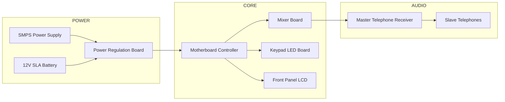
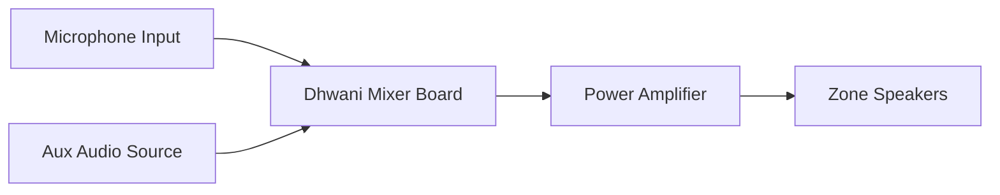
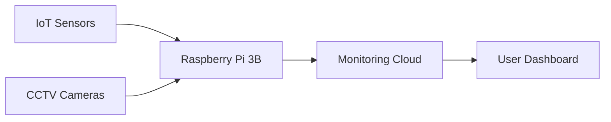
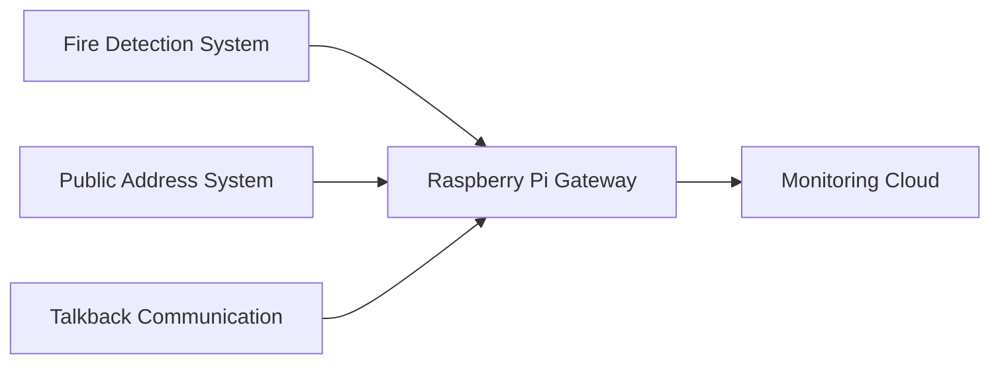

# Integrated Security & Communication Systems Architecture

### IRIS Talkback • Dhwani PA Console • Raspberry Pi 3B • Apollo Series 65 Sounder

---

# 1. IRIS 16-Channel Talkback System

## 1.1 System Overview

The **IRIS Talkback System** provides **two-way audio communication** between a master console and multiple remote telephones.

Typical applications include:

* banks
* control rooms
* industrial monitoring
* security stations
* hospital communication systems

The system supports **up to 16 slave telephone stations** connected to the master console.

Key functional modules include:

* SMPS power supply
* backup battery
* motherboard (system controller)
* mixer board (audio routing)
* keypad LED board
* front panel LCD
* master receiver handset

---

## 1.2 IRIS System Architecture



---

## 1.3 Internal Hardware Connections

```text
+------------------+        +-------------------+
| SMPS Power Unit  | -----> | Pinnacle Power    |
| (EPAX)           |        | Regulation Board  |
+------------------+        +---------+---------+
                                      |
                                      v
                           +----------------------+
                           |    Mother Board      |
                           |  System Controller   |
                           +---+---------+--------+
                               |         |
                      20-PIN   |         | 34-PIN
                               |         v
                               |   +-----------+
                               |   | Front LCD |
                               |   +-----------+
                               |
                               v
                         +--------------+
                         | LED Keypad   |
                         +--------------+

                       26-PIN
                           |
                           v
                      +-----------+
                      | Mixer     |
                      | Board     |
                      +-----------+
                           |
                           v
                  Master Telephone Receiver
                           |
                           v
                    Slave Telephone Units
```

---

## 1.4 Functional Signal Flow

| Component    | Function                    |
| ------------ | --------------------------- |
| SMPS         | Primary power supply        |
| Battery      | Backup during power failure |
| Power Board  | Voltage regulation          |
| Motherboard  | Communication control       |
| Mixer Board  | Audio switching             |
| Keypad Board | Channel selection           |
| LCD          | Status display              |
| Receiver     | Voice communication         |

---

# 2. Dhwani PA Console Mixer

## 2.1 System Description

The **Dhwani Public Address Console** distributes audio announcements to **10 independent speaker zones**.

Typical use cases:

* emergency announcements
* evacuation instructions
* public messaging
* alarm broadcasting

---

## 2.2 Dhwani Mixer Architecture



---

## 2.3 Mixer Board Wiring Diagram

```text
+---------------------------------------------------+
|              DHWANI MIXER BOARD                   |
+---------------------------------------------------+

 AUDIO INPUTS
 -----------------------------------------
 MIC_IN (+,-) -------- External Microphone
 MIC_OUT (+,-) ------- Mic Loop Out
 AUX_IN -------------- Auxiliary Audio Input
 HOOTER_OUT (+,-) ---- Alarm Hooter Output


 ZONE SPEAKER OUTPUTS
 -----------------------------------------
 SPK_1 (+,-) -------- Zone 1 Speakers
 SPK_2 (+,-) -------- Zone 2 Speakers
 SPK_3 (+,-) -------- Zone 3 Speakers
 SPK_4 (+,-) -------- Zone 4 Speakers
 SPK_5 (+,-) -------- Zone 5 Speakers
 SPK_6 (+,-) -------- Zone 6 Speakers
 SPK_7 (+,-) -------- Zone 7 Speakers
 SPK_8 (+,-) -------- Zone 8 Speakers
 SPK_9 (+,-) -------- Zone 9 Speakers
 SPK_10 (+,-) ------- Zone 10 Speakers


 COMMON SPEAKER LOOP
 -----------------------------------------
 SPK_IN (+,-) ------- Amplifier Input
 SPK_OUT (+,-) ------ Loop to Additional Amplifier
```

---

## 2.4 Audio Signal Path

```
Microphone
    │
    ▼
Mixer Board
    │
    ▼
Power Amplifier
    │
    ▼
Speaker Zone Selector
    │
    ▼
Building Speakers
```

---

# 3. Raspberry Pi 3 Model B Hardware Layout

## 3.1 Board Overview

The **Raspberry Pi 3 Model B** is commonly used in:

* IoT monitoring systems
* AI edge computing
* CCTV monitoring
* HMS gateway systems

Key specifications:

| Feature   | Value            |
| --------- | ---------------- |
| CPU       | Broadcom BCM2837 |
| RAM       | 1 GB             |
| Ethernet  | 10/100           |
| WiFi      | 802.11n          |
| Bluetooth | 4.1              |
| USB       | 4 ports          |

---

## 3.2 Physical Board Layout

```text
+-----------------------------------------------------+
|                 Raspberry Pi 3 Model B              |
|                                                     |
| GPIO 40 PIN HEADER                                  |
| --------------------------------------------------  |
|                                                     |
|  +----------------------+                           |
|  |  DSI DISPLAY PORT    |                           |
|  +----------------------+                           |
|                                                     |
|                       +---------------------+       |
|                       | Broadcom BCM2837    |       |
|                       | CPU / SoC           |       |
|                       +---------------------+       |
|                                                     |
| Micro USB Power Input                               |
| HDMI Output                                         |
| 3.5mm AV Jack                                       |
|                                                     |
| +--------------+                                     |
| | CSI Camera   |                                     |
| | Connector    |                                     |
| +--------------+                                     |
|                                                     |
| USB Port 1 | USB Port 2 | USB Port 3 | USB Port 4   |
|                                                     |
| Ethernet (RJ45)                                     |
+-----------------------------------------------------+

Underside:
Micro SD Card Slot
Wi-Fi / Bluetooth Antenna
```

---

## 3.3 Typical Monitoring Architecture



---

# 4. Apollo Series 65 Sounder Base

## 4.1 System Overview

The **Apollo Series 65 Sounder Base** integrates:

* smoke detector mounting base
* sounder circuit

Important rule:

**Detector circuit and sounder circuit must remain electrically isolated.**

---

## 4.2 Sounder Base Wiring

```text
+------------------------------------------------------------+
|           APOLLO SERIES 65 SOUNDER BASE                    |
|                Model 45681-512                             |
+------------------------------------------------------------+

 DETECTOR CIRCUIT TERMINALS

 L1 IN  -------- Detector Loop Positive IN
 L1 OUT -------- Detector Loop Positive OUT
 L2 ----------- Detector Loop Negative
 -R ----------- Remote LED Negative


 SOUNDER CIRCUIT TERMINALS

 SNDR + IN  -------- Sounder Positive Input
 SNDR + OUT -------- Sounder Positive Output
 SNDR - IN  -------- Sounder Negative Input
 SNDR - OUT -------- Sounder Negative Output


 EARTH TERMINALS

 EARTH 1 -------- Detector Circuit Shield
 EARTH 2 -------- Sounder Circuit Shield

 NOTE:
 Earth connections must remain isolated.
```

---

## 4.3 Alarm Signal Flow


---

# 5. Combined System Integration Example



---

# 6. Key Knowledge Retrieval Tags

These keywords improve RAG retrieval accuracy.

```
IRIS talkback system wiring
Dhwani PA mixer board connections
Raspberry Pi 3B board layout
Apollo Series 65 sounder base wiring
industrial talkback communication system
public address zone amplifier wiring
fire alarm sounder base installation
embedded monitoring gateway raspberry pi
```

---

# End of Document
