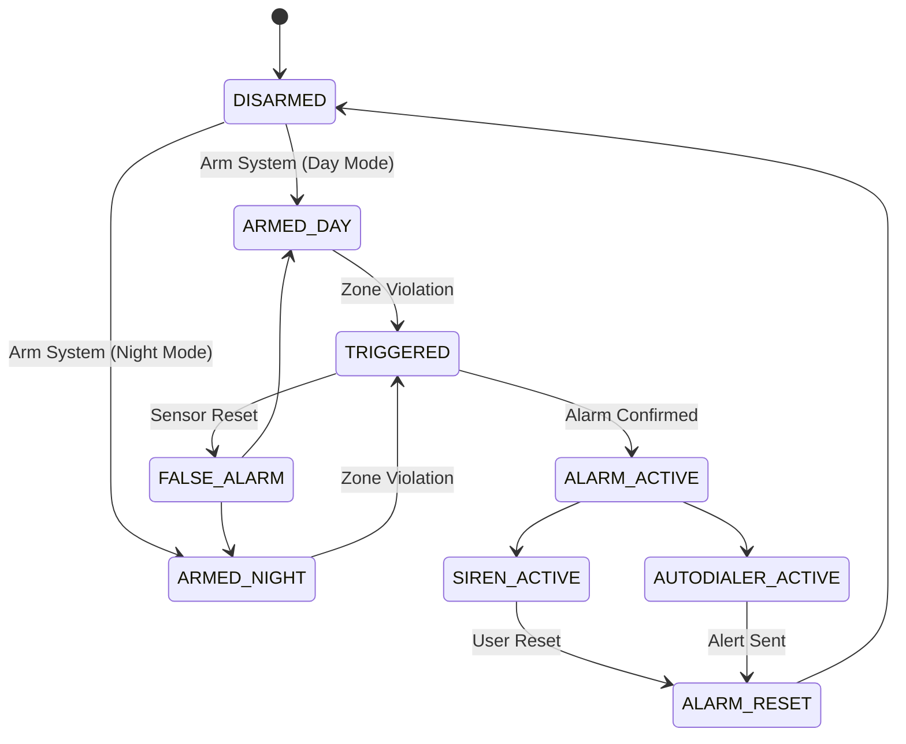

# Security Alarm Event State Machine

This state machine defines how the JARVIS security system behaves during alarm events.

# Alarm State Definitions
| State             | Description               |
| ----------------- | ------------------------- |
| DISARMED          | Security system inactive  |
| ARMED_DAY         | Day sensors active        |
| ARMED_NIGHT       | Night mode sensors active |
| TRIGGERED         | Sensor event detected     |
| ALARM_ACTIVE      | Alarm validated           |
| SIREN_ACTIVE      | Siren output activated    |
| AUTODIALER_ACTIVE | GSM alert transmission    |
| ALARM_RESET       | System reset              |

