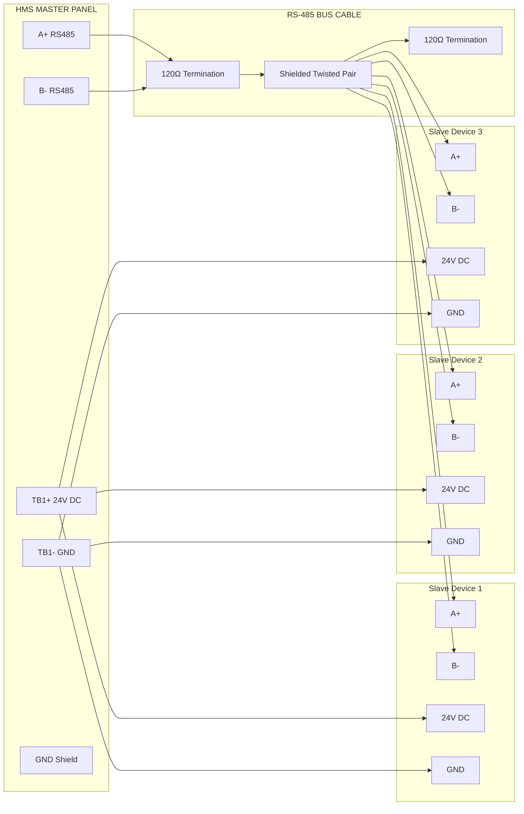

## 🔌 RS-485 Wiring Diagram — HMS Panel

### Connection Overview
```
  ┌──────────────────────┐                      ┌──────────────────────┐
  │     HMS PANEL        │                      │    SLAVE DEVICE      │
  │                      │                      │                      │
  │  TB1+  ──────────────┼───── 🔴 Red ───────► │  24V DC In           │
  │  TB1−  ──────────────┼───── ⚫ Black ─────► │  GND                 │
  │  A+    ──────────────┼───── 🔵 Blue ──────► │  RS-485 A+           │
  │  B−    ──────────────┼───── ⚪ White ─────► │  RS-485 B−           │
  │  GND   ──────────────┼───── 🟡 Yellow ────► │  Shield / PE         │
  └──────────────────────┘                      └──────────────────────┘

  120Ω termination resistor between A+ and B− at BOTH ends of bus
```

### Terminal Connection Table
| Terminal | Signal Type | Wire Colour | Destination | Specification |
|----------|---------------|-------------|---------------|------------------------|
| `TB1+`   | 24V DC Power  | 🔴 Red      | PSU Positive  | `18–30V DC`, max `5A`  |
| `TB1−`   | Ground (0V)   | ⚫ Black    | PSU Negative  | 0V reference           |
| `A+`     | RS-485 Data A | 🔵 Blue     | Slave A+      | EIA-485, differential  |
| `B−`     | RS-485 Data B | ⚪ White    | Slave B−      | EIA-485, differential  |
| `GND`    | Shield / PE   | 🟡 Yellow   | Earth bond    | IEC 60757              |

### Wire Colour Code (IEC 60757)
| Colour     | Signal                      | AWG / mm²          |
|-------------|----------------------------|--------------------|
| 🔴 Red     | DC Positive (+)            | 18 AWG / 1.0mm²    |
| ⚫ Black   | DC Negative / GND          | 18 AWG / 1.0mm²    |
| 🔵 Blue    | RS-485 A+ (Data)           | 22 AWG / 0.5mm²    |
| ⚪ White   | RS-485 B− (Data)           | 22 AWG / 0.5mm²    |
| 🟡 Yellow  | Shield / Protective Earth  | 20 AWG / 0.75mm²   |
| 🟢 Green   | Earth Bond                 | 18 AWG / 1.0mm²    |

### Installation Steps
1. **De-energise** all circuits before starting — verify with multimeter at `TB1+`
2. **Connect power** — `TB1+` → PSU positive (🔴 Red), `TB1−` → PSU negative (⚫ Black)
3. **Connect RS-485** — `A+` → slave `A+` (🔵 Blue), `B−` → slave `B−` (⚪ White)
4. **Add termination** — `120Ω` between `A+` and `B−` at both ends of bus
5. **Connect shield** — single-point earth at panel end only (🟡 Yellow → `GND`)
6. **Power on** — verify `PWR` LED solid 🟢 Green within 3 seconds

### ⚠️ Critical Notes
- Never exceed `30V DC` on power terminals
- RS-485 polarity reversal (`A+`/`B−` swapped) causes silent communication failure
- Always use shielded twisted pair cable for RS-485 runs longer than `10m`
- Maximum bus length: `1200m` at `9600 bps` | `600m` at `19200 bps`

---
> 📚 **Source:** SEPLe standard HMS/Dexter wiring reference (IEC 60757, EIA-485).

# HMS Panel RS-485 Communication Bus

This document describes the **RS-485 wiring architecture for the HMS panel communication network** used in Dexter / SEPLe monitoring systems.

The network uses:

• **Half-duplex differential communication (EIA-485)**  
• **24V DC distributed power**  
• **Shielded twisted pair cabling**

---

# 1. RS-485 System Architecture


### RS-485 Bus Topology
* RS-485 requires a daisy-chain topology.
flowchart LR

MASTER[HMS Panel]

NODE1[Slave Node 1]

NODE2[Slave Node 2]

NODE3[Slave Node 3]

END[Bus End Termination]

MASTER --> NODE1 --> NODE2 --> NODE3 --> END


### Terminal Connection Table
| Panel Terminal | Signal        | Wire Colour | Destination  |
| -------------- | ------------- | ----------- | ------------ |
| TB1+           | 24V DC        | 🔴 Red      | Device Power |
| TB1−           | Ground        | ⚫ Black     | Power Return |
| A+             | RS-485 Data + | 🔵 Blue     | Slave A+     |
| B−             | RS-485 Data − | ⚪ White     | Slave B−     |
| GND            | Shield        | 🟡 Yellow   | Cable Shield |

### RS-485 Electrical Layer
flowchart LR

TX[Master Transmitter]

A1[A+ Differential Line]

B1[B- Differential Line]

RX[Slave Receiver]

TX --> A1
TX --> B1

A1 --> RX
B1 --> RX

### Termination Resistors
flowchart LR

MASTER[Master Panel]

NODE1[Slave Node 1]

NODE2[Slave Node 2]

NODE3[Slave Node 3]

END[End of Bus]

MASTER --> NODE1 --> NODE2 --> NODE3 --> END


### Cable Specifications
| Parameter | Specification |
|-----------|---------------|
| Type      | Shielded Twisted Pair |
| Impedance | 120Ω ± 15% |
| Capacitance | < 150 pF/m |
| Conductor | 22–24 AWG |
| Max Length | 1200m @ 9600 bps |

### Troubleshooting
| Issue | Cause | Solution |
|-------|-------|----------|
| No communication | Polarity reversed | Swap A+ and B− |
| Intermittent errors | Poor termination | Add 120Ω resistors at both ends |
| Long distance | Cable too long | Use repeater or reduce baud rate |
| Noise | Unshielded cable | Use shielded twisted pair |

### Safety Precautions
- Always disconnect power before wiring
- Verify 24V DC with multimeter before connecting
- Do not exceed 32 devices on a single bus
- Keep cable runs under 1200m
- Use proper grounding for shield