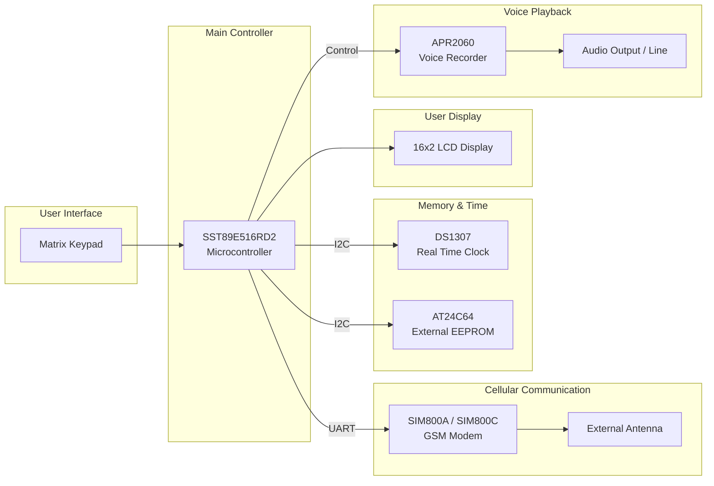
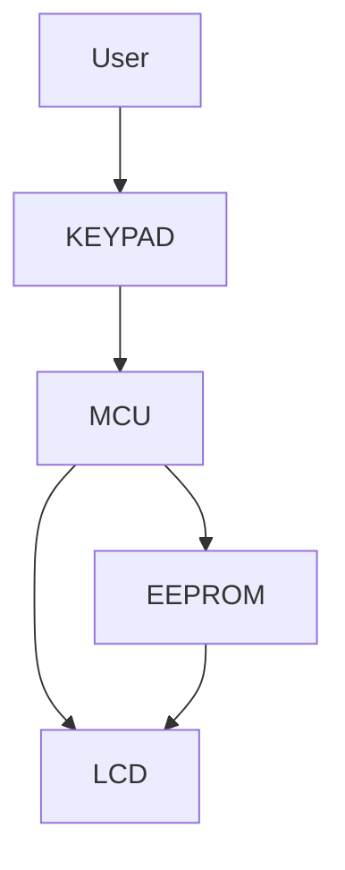

## Whisper G Auto-Dialer System Block Diagram

This diagram shows the internal hardware architecture and component communication protocols for the `Whisper G`.

```text
+-----------------+        I2C         +-----------------+
|  RTC (DS1307)   | <----------------> | EEPROM (AT24C64)|
+-----------------+                    +-----------------+
                                               ^
                                               | I2C
                                               v
+-----------------+                    +-----------------+      TTL-UART     +-----------------+
|                 |                    |                 | <---------------> |   GSM MODEM     |---> (External
|  MATRIX KEYPAD  | -----------------> | MICROCONTROLLER |                   | (SIM800A/800C)  |      Antenna)
|                 |                    | (SST89E516RD2)  |                   +-----------------+
+-----------------+                    |                 |                            |
                                       +-----------------+                            |
                                          |           |                               |
                                          |           +-------------------------------+
                                          v                   (Audio / Control)
                                 +-----------------+            +-----------------+
                                 |   16 x 2 LCD    |            | VOICE RECORDER  |
                                 |    DISPLAY      |            |   (APR2060)     |
                                 +-----------------+            +-----------------+
```

### Component Details
| Component | Part Number | Interface |
|-----------|-------------|-----------|
| RTC | `DS1307` | `I2C` |
| EEPROM | `AT24C64` | `I2C` |
| Microcontroller | `SST89E516RD2` | GPIO / `I2C` / `TTL-UART` |
| GSM Modem | `SIM800A` / `SIM800C` | `TTL-UART` |
| Voice Recorder | `APR2060` | Audio/Control |


# Whisper G Auto-Dialer Architecture

The **Whisper G Auto-Dialer** is an embedded alert communication device used in alarm systems.

Main functions:

• Store phone numbers and configuration  
• Detect alarm triggers  
• Dial numbers using GSM modem  
• Play pre-recorded voice alerts  
• Provide local UI via keypad and LCD  

The system is built around the **SST89E516RD2 microcontroller**.

---

# 1. System Architecture Diagram


# 2. Communication Bus Architecture
flowchart TD

MCU[SST89E516RD2 MCU]

I2C[I2C Bus]

UART[UART Bus]

RTC[DS1307 RTC]

EEPROM[AT24C64 EEPROM]

GSM[SIM800 GSM Modem]

MCU --> I2C

MCU --> UART

I2C --> RTC

I2C --> EEPROM

UART --> GSM

--- Bus Types
| Bus  | Devices           | Function                     |
| ---- | ----------------- | ---------------------------- |
| I²C  | RTC + EEPROM      | Time + configuration storage |
| UART | GSM modem         | Cellular communication       |
| GPIO | Keypad / Voice IC | Control signals              |


### 3. Alarm Trigger → Dial Sequence
flowchart TD

ALARM[Alarm Trigger Input]

ALARM --> MCU

MCU --> READ[Read Phone Numbers\nfrom EEPROM]

READ --> TIME[Timestamp Event\nfrom RTC]

TIME --> DIAL[Send AT Commands\nvia UART]

DIAL --> MODEM[GSM Modem]

MODEM --> CALL[Dial Phone Number]

CALL --> PLAY[Play Voice Message]

PLAY --> VOICE[APR2060 Voice Recorder]

### 4. GSM Communication Stack
flowchart LR

MCU[SST89E516RD2]

UART[TTL UART]

MAX232[Optional Level Shifter]

MODEM[SIM800 GSM Module]

NETWORK[Cellular Network]

MCU --> UART

UART --> MODEM

MODEM --> NETWORK

### 5. Voice Playback System

flowchart LR

MCU[Microcontroller]

VOICE[APR2060 Voice Recorder]

AMP[Audio Amplifier]

SPK[Speaker Output]

MCU --> VOICE

VOICE --> AMP

AMP --> SPK


"Fire alarm activated. Please check immediately."
``` id="wg_audio_msg"

---
```
### 6. User Interface Operation


```
```
### 7. Power Distribution
flowchart TD

PSU[12V DC Power Supply]

REG[Voltage Regulator]

MCU[SST89E516RD2]

RTC[RTC]

EEPROM[EEPROM]

MODEM[GSM Modem]

VOICE[Voice IC]

PSU --> REG

REG --> MCU

REG --> RTC

REG --> EEPROM

REG --> MODEM

REG --> VOICE

### 8. Internal Data Flow
Alarm Input
      ↓
Microcontroller Processing
      ↓
Read Contact Numbers
      ↓
Send AT Command to GSM
      ↓
GSM Modem Dials Number
      ↓
Voice Message Playback

### 9. Hardware Component Summary
| Component       | Part         | Role                   |
| --------------- | ------------ | ---------------------- |
| Microcontroller | SST89E516RD2 | System control         |
| RTC             | DS1307       | Timekeeping            |
| EEPROM          | AT24C64      | Phone number storage   |
| GSM Modem       | SIM800A/C    | Cellular communication |
| Voice IC        | APR2060      | Voice message playback |
| Display         | 16x2 LCD     | User interface         |
