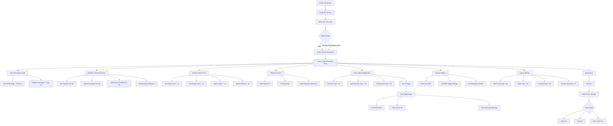

# Whisper Auto-Dialer – System Architecture Diagram

---

## Default Credentials

| Type            | Password |
| --------------- | -------- |
| User Password   | `1234`   |
| Master Password | `1367`   |

> The **Master Password cannot be changed**.
